# JAVA DESIGN PATTERNS & SOLID PRINCIPLES

Vamos a estudiar principios SOLID y patrones de diseño.

## Project Setup

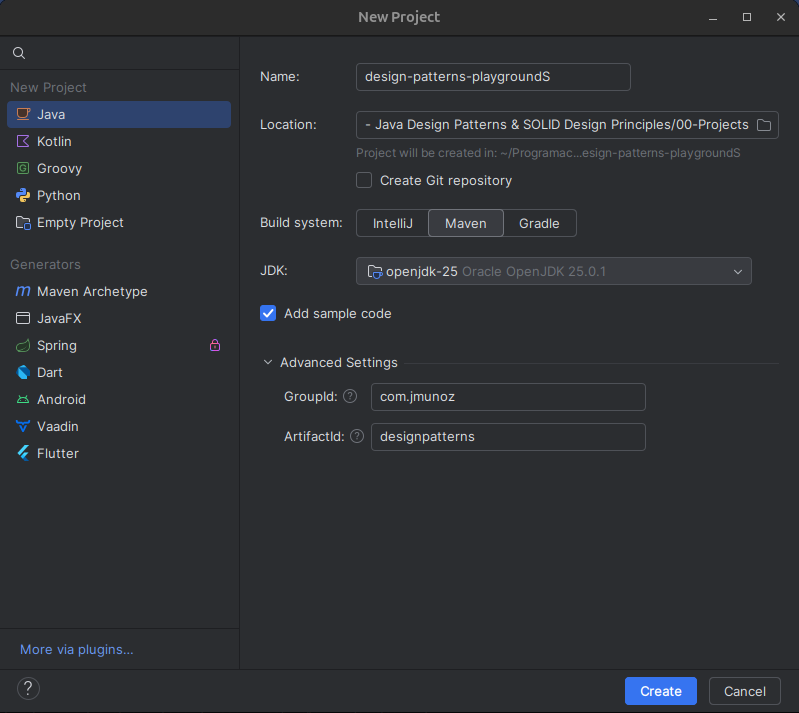

## SOLID Design Principles

Vamos a hablar de los principios SOLID.

SOLID es un acrónimo que representa cinco principios de diseño.

- Single Responsibility Principle.
- Open / Closed Principle.
- Liskov Substitution Principle.
- Interface Segregation Principle.
- Dependency Inversion Principle.

[Principios SOILD](../SOLID+Design+Principles.pdf)

### Single Responsibility Principle

**Nunca debería haber más de una razón para que una clase cambie.**

Esto significa que la clase debe proveer una funcionalidad muy focalizada o abordar una preocupación específica de nuestra funcionalidad deseada.

Al hacer una clase nos tenemos que preguntar ¿cuáles son las posibles razones para que esta clase tenga que cambiar? Si hay más de una razón, entonces no sigue este principio.

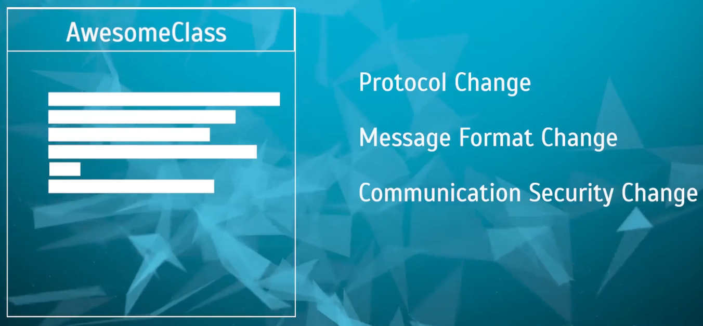

Si, por ejemplo, en una clase tenemos 3 responsabilidades distintas, entonces tenemos que separarlas en 3 clases, cada una gestionando una responsabilidad.

De esta forma, si algo cambia, nuestro código puede cambiarse de una manera organizada.

En `src/java/com/jmunoz` creamos los paquetes/clases siguientes:

- `sec01`
  - `singleresp`: Nuevo paquete para el principio de responsabilidad única.
    - `bad`: Nuevo paquete donde violamos el principio.
      - `UserController`: Simula un controller hecho en una aplicación Spring Web MVC.
      - `User`
      - `Store`: Clase que simula algo que se almacena en base de datos.
      - `Main`: Clase que prueba toda la funcionalidad de `UserController`.
    - `good`: Nuevo paquete donde seguimos el principio.
      - `UserController`: Simula un controller hecho en una aplicación Spring Web MVC.
      - `User`
      - `Store`: Clase que simula algo que se almacena en base de datos.
      - `Main`: Clase que prueba toda la funcionalidad de `UserController`.
      - `UserValidator`: Clase que contiene las validaciones.
      - `UserPersistenceService`: Clase que contiene la lógica para guardar en BD (en el ejemplo un HashMap)

Si queremos probar si un código o clase existente satisface el principio de responsabilidad único, tenemos que preguntarnos qué es lo que se supone que tiene que hacer la clase y qué es lo que está haciendo ahora mismo.

- En una aplicación MVC, un controller se supone que debe recibir peticiones de un cliente, entregarlas al resto de la aplicación para su procesamiento, obtener los resultados de ese procesamiento y devolver la respuesta al cliente.
- El controller no debe tener lógica de negocio en él.

Lo primero que tenemos que tener en cuenta a la hora de hacer algún cambio (refactor) es tener una buena batería de tests que prueben el código actual. Esto es porque no queremos introducir nuevos errores como resultado de la refactorizacion.

Nuestra clase `Main` sirve como clase de tests, pero en la vida real, necesitaremos usar la dependencia `JUnit` para crear tests.

Para hacer la refactorización, tenemos que identificar una responsabilidad que tenga la clase, en este caso `UserController`, que no debería tener.

Por ejemplo, la validación es algo que un controller no debe hacer. Entonces, creamos la clase `UserValidator` y nos llevamos ahí las validaciones. Nuestra clase `UserController` usará `UserValidator`.

Después de cada cambio, tenemos que ejecutar nuestros tests (en este ejemplo la clase `Main`) para comprobar que todo siga funcionando como antes de la refactorización.

**FAQ**

1. ¿Una utility class que contiene solo métodos estáticos viola SRP?

Una utility class es una colección de diferentes funciones. Así que, estrictamente hablando, si viola SRP.

En general, cuando se trata de métodos estáticos, la mayoría de los patrones y principios de POO quedan relegados a un segundo plano. Esto es porque un método estático no participa en ninguna característica importante de POO como la herencia, polimorfismo, etc.

Las utility classes son útiles para agrupar métodos reutilizables sin estado. Sin embargo, infringen tanto SRP como Open/Close.

La conclusión es que, para código reutilizable sin estado, se pueden usar utility classes. Sin embargo, deben diseñarse con cuidado para que los métodos estén al menos relacionados entre sí, como métodos de agrupación para trabajar con fechas, cadenas u otros tipos en una clase. Por lo tanto, incluso si violamos SRP y Open/Close, que exista al menos cierta cohesión. No crear nunca una única megaclase de utilidad donde se almacenan todos los métodos estáticos.

Estos métodos deben permanecer sin estado (no añadir variables non-final static que estos métodos utilicen o modifiquen) y siempre use métodos de utilidad solo si el método de instancia de una clase no tiene sentido, como último recurso.

2. En `UserController`, `UserValidator` es una variable local del método `createUser()`, mientras que `UserPersistanceStoreService` es un campo de `UserController`. ¿Cómo determinar si las clases recién creadas deben declararse como campos de Object o como variables locales en los métodos?

Es muy difícil establecer reglas precisas para esto, pero:

En general, si una variable se requiere en más de un método y ADEMÁS si su valor cambia durante la existencia del objeto y este cambio afecta también su comportamiento, podemos mantener la variable como un campo de esa clase.

Otro escenario estrechamente relacionado con el punto anterior es que el valor de la variable puede ser establecido por código externo tras la creación del objeto, y este nuevo valor es requerido por los métodos de dicho objeto para proporcionar funcionalidad. En este caso, la variable será un campo y otro código puede establecerlo mediante un setter. Para preservar ese valor para su uso posterior, se requiere un campo.

Un tercer escenario, no tan elegante, pero a veces práctico, es que el valor de la variable es costoso de establecer (por ejemplo, valor es un objeto nuevo cuya instanciación es costosa). Por lo tanto, aunque dicha variable pueda usarse en un solo método, la mantenemos como un campo para que las invocaciones posteriores de ese mismo método no requieran la creación/obtención de ese valor.

Las variables locales se utilizan si no tienen utilidad fuera del método, son económicas de crear y también si su estado después de su uso no es adecuado fuera de dicho método.

Tener en cuenta que estas no son las únicas condiciones para esta decisión, pero son algunas de las condiciones obvias para decidir entre un campo o una variable local.

Ahora, veamos nuestro ejemplo:

En muchas aplicaciones MVC del mundo real, el controlador recibe las dependencias requeridas, como el servicio de persistencia, mediante un contenedor IoC como Spring. Por lo tanto, normalmente encontrará controladores que declaran sus dependencias como campos, los cuales están conectados por algo como Spring.

Además, un servicio de persistencia se suele utilizar en más de un método, por ejemplo, guardar usuario, buscar un usuario, obtener todos los usuarios, etc.

Los validadores suelen ser objetos de bajo consumo, económicos de crear y no necesarios en todos los métodos. Por ejemplo, los métodos de búsqueda de usuario u obtención de todos los usuarios no requieren `UserValidator`.

Nuestro ejemplo de código no declara todos esos otros métodos, pero espero que esto aclare por qué necesitamos algunos objetos como campos y otros como variables locales.

3. En `UserValidator`, ver la línea `user.setName(user.getName().trim());`. `UserValidator` solo valida al usuario. No debería llamar a la función setter, ya que no forma parte de la validación.

¡Correcto!

Código como el anterior a veces se denomina "sanitización de entrada". Este código garantiza la seguridad de la entrada y elimina espacios en blanco y caracteres especiales añadidos inadvertidamente.

Marcar un espacio final como error de validación molestará a todos los usuarios, por lo que la mayoría de los sitios web sanearán al menos los espacios en blanco iniciales y finales antes de procesar la entrada para su validación. Normalmente, esto debería ocurrir en el lado del cliente, lo que significa que Angular/React o cualquier frontend que usemos debería realizar primero la `sanitization`. Sin embargo, el backend también debe realizar la misma `sanitization` como medida de seguridad. La razón es que algunos frontend nuevos podrían olvidar realizarla.

Siguiendo el SRP, un buen diseño consiste en tener una clase de `sanitization` de entrada adecuada cuya función sea SOLO tomar la entrada y sanitizarla por seguridad y conveniencia, eliminando espacios en blanco no deseados, caracteres especiales, etc. Sin embargo, en la vida real, la validación y la `sanitization` a menudo se combinan, ya que están relacionadas. Pero el punto sigue siendo válido: al menos en la lección sobre SRP, no deberían estar en la misma clase. Lo omitimos en nuestro ejemplo, ya que tener demasiadas clases complica los ejemplos para los nuevos usuarios.

### Open-Closed Principle

**Las entidades de software (clases, módulos, métodos, etc.) deben estar abiertas para la extensión, pero cerradas para la modificación**

Cuando decimos abierto para la extensión, significa que debemos ser capaces de extender el comportamiento existente.

Cuando decimos cerrado para la modificación, significa que el código que ya está escrito no debería tener que cambiarse.

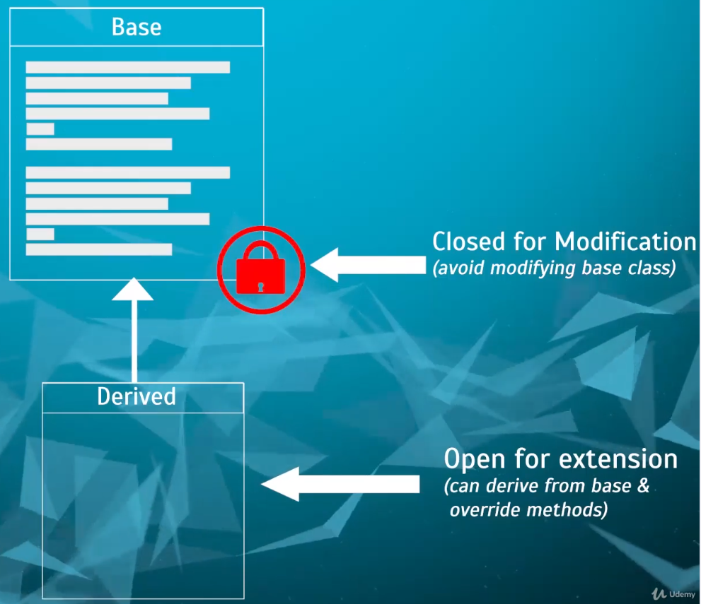

Imaginemos que tenemos una clase base en Java que ya está escrita y probada. Si queremos extenderla o modificar el comportamiento de uno de sus métodos, debemos ser capaces de hacerlo usando **herencia**, es decir, creando una clase derivada y haciendo override del método.

Cerrado para la modificación significa que no deberíamos tener que modificar el código del método directamente en la clase base.

En `src/java/com/jmunoz` creamos los paquetes/clases siguientes:

- `sec01`
  - `openclosed`: Nuevo paquete para el principio de open-closed.
    - `bad`: Nuevo paquete donde violamos el principio.
      - `PhoneSubscriber`: Clase de suscriptores de una compañía telefónica.
        - Tiene un método `calculateBill()` y los campos que identifican un suscriptor.
      - `ISPSubscriber`: Clase de suscriptores a servicios de Internet.
        - Tiene un método `calculateBill()` y los campos que identifican un suscriptor.
      - `CallHistory`: Clase para llevar la cuenta del uso de data del móvil. No es importante para Open/Close y está para dar la sensación de una app completa.
      - `InternetSessionHistory`: Clase para llevar la cuenta del uso de data de Internet. No es importante para Open/Close y está para dar la sensación de una app completa.
    - `good`: Nuevo paquete donde seguimos el principio. En concreto eliminamos la duplicidad `calculateBill()`, pero además vemos que distintos tipos de subscriber básicamente solo tienen como diferencia la forma de calcular la factura.
      - `Subscriber`: Clase abstracta que representa un suscriptor. No indicamos de que es suscriptor.
        - Formada por los campos comunes que identifican un suscriptor en las clases `PhoneSubscriber` y `ISPSubscriber` y el cálculo de la factura (método abstracto).
        - Cerrada para modificación.
      - `PhoneSubscriber`: Clase de suscriptores de una compañía telefónica.
        - Ahora extiende de `Subscriber` y solo implementa el método `calculateBill()`, abierto a extensión.
      - `ISPSubscriber`: Clase de suscriptores a servicios de Internet.
        - Ahora extiende de `Subscriber` y solo implementa el método `calculateBill()`, abierto a extensión.
      - `CallHistory`: Clase para llevar la cuenta del uso de data del móvil. No es importante para Open/Close y está para dar la sensación de una app completa.
      - `InternetSessionHistory`: Clase para llevar la cuenta del uso de data de Internet. No es importante para Open/Close y está para dar la sensación de una app completa.

Por tanto, lo que hemos hecho ha sido coger todo lo que hay común en clases y que no va a cambiar, en nuestro ejemplo la entidad de Subscriber. Hemos hecho una clase base (abstracta) `Subscriber` cuya idea es que esté cerrada para modificación.

Hemos creado en esa clase abstracta un método abstracto `calculateBill()` para que otras clases que hereden de `Subscriber` puedan extender el comportamiento de ese cálculo de factura a como se necesite.

### Liskov Substitution Principle

**Debemos poder sustituir objetos de clase base con objetos de clase hija y esto no debe alterar el comportamiento / características del programa.**

Si el objeto clase base provee un comportamiento específico y es sustituido por un objeto clase hijo, ese comportamiento debe ser el mismo.

En `src/java/com/jmunoz` creamos los paquetes/clases siguientes:

- `sec01`
  - `liskov`: Nuevo paquete para el principio de sustitución de Liskov.
    - `bad`: Nuevo paquete donde violamos el principio.
      - `Rectangle`: Clase rectángulo.
      - `Square`: Clase cuadrado. Es un tipo especial de rectángulo y extiende de él.
        - Podemos decir que un cuadrado es un rectángulo, si los campos width y height tienen el mismo valor.
      - `Main`: Clase principal para hacer las pruebas.
        - Para ejecutar y ver las aserciones, ir a la configuración de ejecución e indicar en los argumentos VM `-ea`.
        - 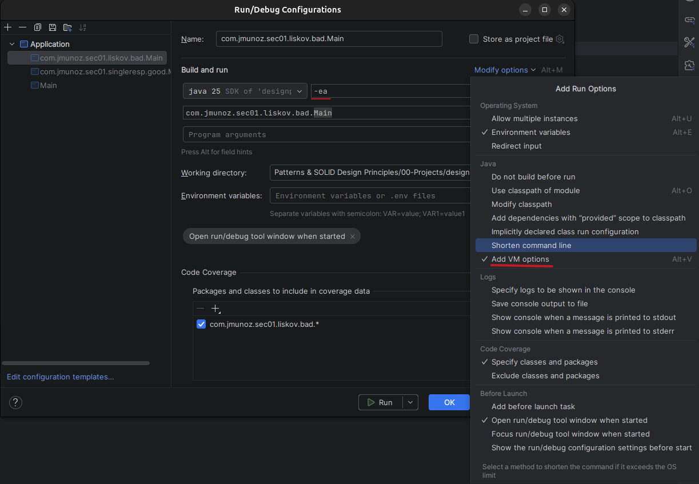
        - Al ejecutar vemos que falla un test cuando se pasa a `useRectangle()` un cuadrado. Esto es porque en un cuadrado width y height tienen que tener el mismo valor, y ya no cumple los valores indicados en `useRectangle()`.
        - No se cumple Liskov.
    - `good`: Nuevo paquete donde seguimos el principio. Tenemos que romper la relación `Square extends Rectangle` porque cuando hablamos de programación orientada a objetos, un cuadrado NO es un rectángulo.
      - `Shape`: Interface con un solo comportamiento definido en ella, `computeArea()`.
      - `Rectangle`: Clase rectángulo que implementa `Shape`.
      - `Square`: Clase cuadrado que implementa `Shape`.
      - `Main`: Clase principal para hacer las pruebas.
        - Ahora el método `useRectangle()` solo aplica a rectángulos, para evitar violar el principio Liskov.
        - Para ejecutar y ver las aserciones, ir a la configuración de ejecución e indicar en los argumentos VM `-ea`.

### Interface Segregation Principle

**Los clientes no deber ser forzados a depender de interfaces que no usan**

En particular hablamos de métodos, es decir, los clientes no deberían tener que depender de métodos que están definidos en interfaces, pero que no usan.

Existe un término llamado `interface pollution` que significa que no deberíamos hacer nuestras interfaces muy grandes, atiborradas de métodos no relacionados entre sí y que luego nuestras clases implementen esa interface.

Una forma muy fácil de ver que este principio es violado, es buscar:

- Clases que tienen implementaciones de métodos vacías, sin código.
- Métodos que lanzan la excepción `UnsupportedOperationException` (o similar).
- Implementaciones de métodos que devuelven null o valores por defecto / dummy.

En todos estos casos, al final hablamos de métodos que no tienen sentido para esa clase en particular.

La solución para esto consiste en romper esas interfaces tan grandes en otras interfaces más pequeñas, pero no de cualquier modo.

Los métodos o comportamientos o contratos que estén definidos en estas nuevas interfaces más pequeñas deben estar relacionados entre ellos. Buscamos cohesión, porque no queremos que una clase esté forzada a proveer una implementación de un método que para esa clase no tiene sentido.

En `src/java/com/jmunoz` creamos los paquetes/clases siguientes:

- `sec01`
  - `segregation`: Nuevo paquete para el principio de segregación de interfaces.
    - `bad`
      - `entity`:
        - `Entity`: Clase base para nuestras entidades JPA.
        - `User`: Clase que extiende de `Entity`.
        - `Order`: Clase que extiende de `Entity`.
      - `service`:
        - `PersistenceService`: Interface común para las operaciones de persistencia.
          - Tenemos `save()`, `delete()`, `findById()` y `findByName()`. 
        - `UserPersistenceService`: Clase que realiza operaciones de persistencia para un `User`.
          - Tenemos `save()`, `delete()`, `findById()` y `findByName()` y las utilizamos todas. 
        - `OrderPersistenceService`: Clase que realiza operaciones de persistencia para un `User`.
          - Tenemos `save()`, `delete()` y `findById()`.
          - El método `findByName()` no tiene sentido para un pedido, y lanza una excepción `UnsupportedOperationException`.
          - No cumple el principio de segregación de interfaces.
    - `good`
      - `entity`:
        - `Entity`: Clase base para nuestras entidades JPA.
        - `User`: Clase que extiende de `Entity`.
        - `Order`: Clase que extiende de `Entity`.
      - `service`:
        - `PersistenceService`: Interface común para las operaciones de persistencia.
          - Tenemos `save()`, `delete()` y `findById()`.
          - Ya no tenemos `findByName()`. Como es solo un método no creamos otra interface.
        - `UserPersistenceService`: Clase que realiza operaciones de persistencia para un `User`.
          - Tenemos `save()`, `delete()` y `findById()`.
          - `findByName()` la creamos para esta clase.
        - `OrderPersistenceService`: Clase que realiza operaciones de persistencia para un `User`.
          - Tenemos `save()`, `delete()` y `findById()`.
          - Ya no tenemos que implementar `findByName()`, porque no aparece en la interface.

### Dependency Inversion Principle

Este principio viene en dos partes diferentes:

**A: Los módulos de alto nivel no deben depender de módulos de bajo nivel. Ambos deben depender de abstracciones**

**B: Las abstracciones no deben depender de los detalles. Los detalles deben depender de abstracciones**

Cuando decimos módulo de alto nivel, queremos decir un módulo que provee o implementa reglas de negocio.

Cuando decimos módulo de bajo nivel, queremos indicar una funcionalidad que es tan básica que puede usarse en cualquier sitio, por ejemplo, escribir en disco o convertir un objeto Java en Json.

Una abstracción es algo tan sencillo como una interface.

Por último, tenemos que entender es que es una `dependencia`.

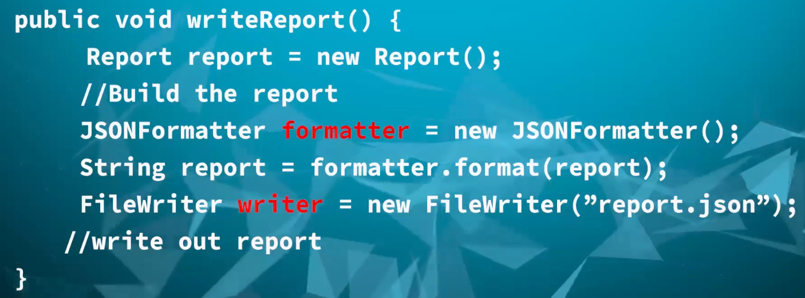

Para esta función, las dependencias son `JSONFormatter()` y `FileWriter()`. Es decir, una dependencia es algo que necesitamos para proveer la funcionalidad que queremos a nuestro código.

Cuando hablamos de inversión de dependencias, hablamos de hacer lo contrario a lo que normalmente hacemos.

Lo que normalmente hacemos para crear una dependencia, tal y como podemos ver en la imagen, es crear un objeto usando el operador `new`.

El problema de usar `new` es que produce un acople fuerte de esa implementación en particular, y cualquier cambio en los requerimientos va a hacer que tengamos que modificar el código, lo que puede producir errores.

Para evitar esto es para lo que usamos la inversión de dependencias.

En vez de crear una instancia de un Object Mapper o de un FileWriter usando `new`, podemos usar dos interfaces, `Writer` y `Formatter`, por ejemplo, y escribiremos nuestro módulo de alto nivel usando esa interface.

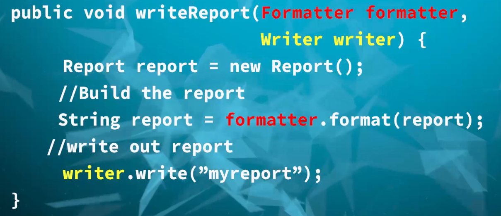

Vemos en esta imagen que, en vez de usar `new`, aceptamos parámetros de esas interfaces y escribimos nuestro código usando estas interfaces.

De repente, nuestro código ya no queda fuertemente acoplado a ninguna clase concreta.

En vez de instanciar las dependencias nosotros, es otra cosa la las crea y nos da las dependencias.

En `src/java/com/jmunoz` creamos los paquetes/clases siguientes:

- `sec01`
  - `di`: Nuevo paquete para el principio de inversión de dependencias.
    - `bad`
      - `MessagePrinter`: Clase que recibe un objeto `Message` y un nombre de fichero, lo convierte a formato JSON y lo escribe en disco.
        - Tiene dependencias que hacen el código fuertemente acoplado a esas implementaciones (`JSONFormatter()` y `PrintWritter()`).
      - `Message`: Solo para completar la app.
      - `TextFormatter`: Solo para completar la app.
      - `FormatException`: Solo para completar la app.
      - `Formatter`: Solo para completar la app.
      - `JSONFormatter`: Solo para completar la app.
      - `Main`: Clase principal para las pruebas.
    - `good`
      - `MessagePrinter`: Clase que recibe un objeto `Message`, un objeto `Formatter` y un objeto `PrintWritter` para convertir el mensaje a formato JSON y escribirlo en disco.
        - Usa inversión de dependencias que hacen que el código no quede acoplado a implementaciones concretas.
      - `Message`: Solo para completar la app.
      - `TextFormatter`: Solo para completar la app.
      - `FormatException`: Solo para completar la app.
      - `Formatter`: Solo para completar la app.
      - `JSONFormatter`: Solo para completar la app.
      - `Main`: Clase principal para las pruebas. Crea y pasa las instancias de `Formatter` y `PrintWritter`.

## Creational Design Patterns

Los patrones de diseño creacionales tratan con la creación de objetos de clases.

¿Por qué necesitamos patrones de diseño para crear un objeto de una clase? ¿No podemos usar el operador `new` y ya está?

Si, pero hay muchos requisitos adicionales que tienen lugar cuando estamos desarrollando una aplicación real.

Por ejemplo, nuestro objeto podría necesitar muchos otros objetos antes de que pueda crearse, o puede necesitar muchos pasos para poder crearse, como leer data de un fichero o hacer una query para leer de BD y de ahí crear el objeto final.

Otro requerimiento posible es que solo pueda existir un objeto de esa clase en toda la aplicación, porque esa clase puede ser una configuración.

Estos son los patrones de diseño creacionales que vamos a ver en el curso:

- Builder
- Simple Factory
- Factory Method
- Prototype
- Singleton
- Abstract Factory
- Object Pool

### Builder

#### Builder - Introduction

Es un patrón de diseño creacional. Usaremos `builder` cuando queramos construir objetos de una clase.

¿Qué problema resuelve el patrón de diseño `builder`?

**1. Los constructores de una clase requieren mucha información.**

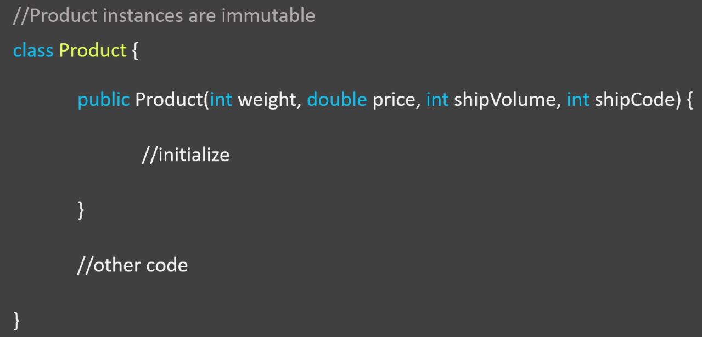

Aquí tenemos una clase llamada `Product` y digamos que tenemos un requerimiento que dice que los objetos de esta clase deben ser inmutables.

Un objeto inmutable significa que su estado o propiedades no pueden cambiarse una vez que el objeto se ha creado. Un ejemplo es la clase `String`, cuyos objetos son inmutables.

Cuando escribimos clases inmutables, normalmente terminamos haciendo constructores con varios parámetros, ya que tenemos que proveer toda la información de estado para el objeto en el mismo constructor.

Tener un método o constructor que necesita muchos argumentos es considerado una mala práctica, ya que cualquiera que use ese código tiene que descubrir que significa cada parámetro para poder pasar el valor correcto en la secuencia correcta.

Si nuestros argumentos son similares o del mismo tipo de dato, el problema es todavía más grande.

En el ejemplo de la imagen, tenemos que pasar varios valores numéricos. Aunque parezca que el nombre del parámetro sirve como documentación puede que distribuyamos el código de manera ya compilada en un fichero `jar` a otros desarrolladores, por lo que no tienen acceso a los nombres de los argumentos esperados.

Aquí es donde el patrón de diseño `builder` puede ayudarnos.

- Hace más fácil usar constructores para crear objetos de la clase.
- Evitan construir constructores innecesarios e igualmente tener objetos inmutables.

**2. Objetos que necesitan otros objetos o "partes" para construirlos.**

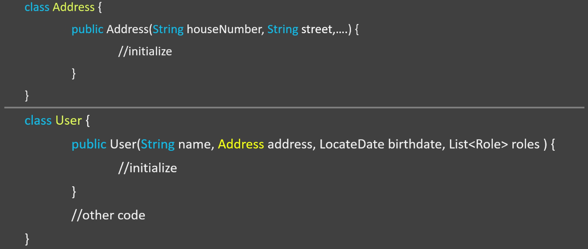

En este ejemplo tenemos las clases `Address` y `User`. Si vemos la clase `User` vemos que necesitamos un objeto de tipo `Address` y una lista de `Role` para poder crear mi objeto de tipo `User`.

Podemos pensar en los objetos `Address` y `Role` como las partes que utilizamos para montar nuestro objeto `User`.

Hay ciertos pasos que tenemos que seguir, como son la creación del objeto `Address`, varios objetos `Role` y la creación de una colección que los contenga, antes de poder llamar a nuestro constructor para crear un objeto `User`.

En estos casos también es muy útil el patrón `builder`.

**Por tanto, ¿cuándo y cómo usaremos el patrón de diseño `Builder`?**

- Cuando para construir un objeto es necesario seguir un proceso complejo que conlleva muchos pasos.
  - Complejo se refiere a una gran cantidad de argumentos que el constructor necesita o a una gran cantidad de pasos necesarios para poder crear un objeto.
- En `builder` eliminamos del código del cliente la lógica relacionada con la construcción del objeto y lo abstraemos en clases separadas, de forma que el cliente de nuestro objeto pueda crear esos objetos fácilmente.

**UML**

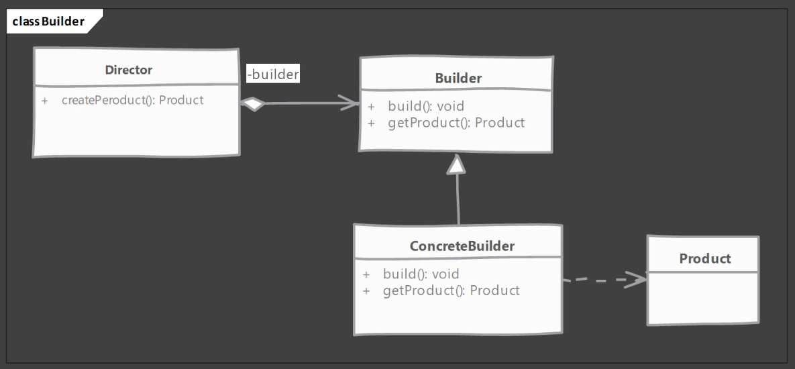

Vemos que existen 4 roles diferentes en este patrón de diseño.

- Rol - Product
  - Clase Product: Queremos crear objetos (que son complejos) de esta clase. Es el resultado final que queremos construir.
  - Product se refiere a algo final, no a un producto físico como un IPhone.
- Rol - Builder
  - Es una interface para crear las ¨partes" de nuestro objeto Product.
  - También provee un método `build()` para instanciar el objeto final.
  - También pueden proveer un método, `getProduct()` en nuestro ejemplo, que pueden usar los desarrolladores para consultar un objeto construido.
- Rol - ConcreteBuilder
  - Es la implementación del rol Builder. 
  - Construye las distintas partes y monta el product final.
  - Opcionalmente, puede mantener la traza de los product creados.
- Rol - Director
  - Es quien llama a los métodos descritos en el rol Builder.
  - Usa el rol Builder para construir un objeto.
  - Conoce los pasos y la secuencia para construir un product.

#### Builder - Implementation Steps

Vamos a ver los pasos necesarios cuando queremos implementar un `Builder` en nuestro código:

- Comenzamos creando el `builder`.
  - Identificamos las "partes" (y/o los pasos) del producto y proveemos métodos para crear esas partes.
  - Debemos proveer un método para montar o construir, llamado normalmente `build()`, el producto/objeto.
  - Debemos proveer una forma o método para consultar un objeto ya construido.
  - Opcionalmente, `builder` puede mantener una referencia al producto construido, de tal forma que pueda ser consultado de nuevo en el futuro.
- Necesitamos un director, que puede ser una clase separada (esto es más raro), o bien el cliente puede tener el rol de director también (lo más normal).

#### Builder - Example UML

Este es el UML del ejemplo de patrón de diseño `Builder` que vamos a construir en Java.

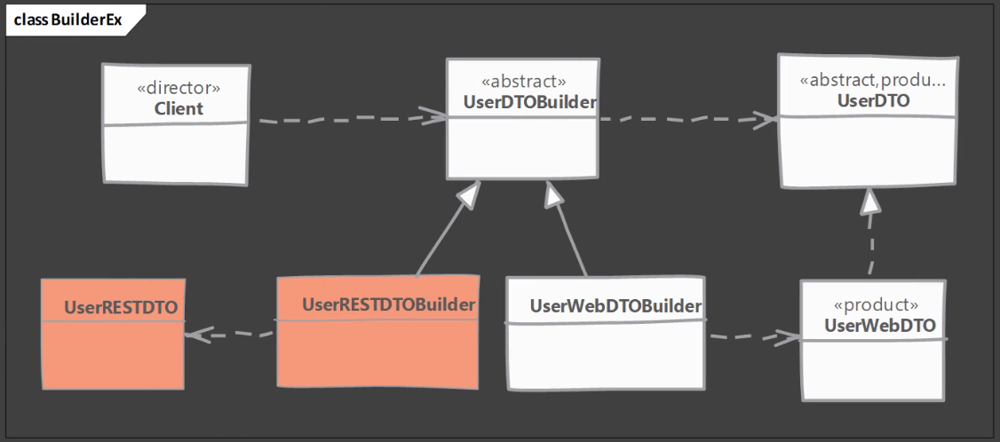

- `UserDTO`: Es una interface DTO (data transfer object).
- `UserWebDTO` Es una implementación concreta de `UserDTO`. Es lo que queremos construir, nuestro producto final. Es el rol `Product`.
- `UserWebDTOBuilder`: Es la clase que usaremos para crear `UserWebDTO`. Implementa `UserDTOBuilder`. Es el rol `ConcreteBuilder`.
- `UserDTOBuilder`: Es una interface o clase abstracta que sencillamente define los métodos que corresponden a cada "parte" del objeto `UserDTO`. Es el rol `Builder`.
- `Client`: Es nuestra clase principal con método `main`. Es el rol `Director`.
- Las clases que pueden verse en color naranja son ejemplos de como podemos mejorar aún más este ejemplo. `UserRESTDTOBuilder` es otra implementación de `UserDTOBuilder` que podemos usar para construir otro tipo de objeto, `UserRESTDTO`.
  - Es un ejemplo de como podemos extender el patrón de diseño `Builder`.

#### Builder - Implementation

En `src/java/com/jmunoz` creamos los paquetes/clases siguientes:

- `sec02`
  - `builder`
    - `Address`: Clase normal usada en `User` para almacenar información de la dirección del usuario.
    - `User`: Clase Entity usada para construir el DTO. Este objeto lo obtendríamos desde una capa de persistencia, con data almacenada en BD.
    - `UserDTO`: Interface DTO.
    - `UserWebDTO`: Implementación de `UserDTO`. Cumple el rol `Product`, producto final a obtener del patrón `builder`. Vamos, lo que queremos construir.
    - `UserDTOBuilder`: Es una interface que provee los métodos necesarios para montar cada "parte" de nuestro objeto `UserDTO`. Es el rol `Builder`.
      - Cada uno de estos métodos devuelve una referencia a sí mismo (al builder), así que usaremos este tipo de implementación para usar `method chaining`.
      - El método `build()` es el que monta el objeto final.
    - `UserWebDTOBuilder`: Es una implementación concreta de `UserDTOBuilder`. Es el rol `ConcreteBuilder`.
      - Es lo que realmente construimos en esta clase.
    - `Client`: Es nuestra clase principal con el rol de `Director` que usa el builder `UserDTOBuilder`.

#### Builder - Implementation 2

Vamos a ver otra forma muy común de implementar el patrón `builder` en el mundo real.

En `src/java/com/jmunoz` creamos los paquetes/clases siguientes:

- `sec02`
  - `builder2`
    - `Address`: Clase normal usada en `User` para almacenar información de la dirección del usuario.
    - `User`: Clase Entity usada para construir el DTO. Este objeto lo obtendríamos desde una capa de persistencia, con data almacenada en BD.
    - `UserDTO`: Interface DTO. Cumple el rol de `Product`. Queremos crear objetos de esta clase.
      - No tenemos constructor, pero vamos a construir una instancia inmutable, usando métodos getter public y métodos setter private.
      - Es decir, esta forma de implementar el `builder` evita tener que tratar con constructores complejos.
      - Declaramos nuestro `builder` como una `inner static class`. Es decir, nuestro `builder` está contenido dentro de la clase cuyo objeto va a construir. Como es una clase interna, puede usar los métodos setter private.
      - Seguimos teniendo métodos para construir las partes de nuestro objeto.
      - Algo que también es común, pero no obligatorio, es un método estático dentro de nuestra clase `Product`, llamado `getBuilder()`, que devuelve una nueva instancia de nuestro `builder`. 
    - `Client`: Es nuestra clase principal con el rol de `Director` que usa el método estático `getBuilder()`.

#### Builder - Implementation & Design Considerations

- Consideraciones de la implementación
  - Podemos crear fácilmente una clase inmutable implementando `builder` como una `inner static class`. Esta forma de implementación es usada muy frecuentemente incluso aunque la inmutabilidad no sea lo que se esté buscando.
- Consideraciones de diseño
  - El rol de `director` no se suele implementar como una clase separada. Típicamente, el consumer de la instancia del objeto o el cliente toman ese rol.
  - Un `Abstract builder` tampoco es requerido si el `product` mismo no es parte de ninguna jerarquía de herencia. Se puede crear directamente el `concrete builder`.
  - Si tenemos el problema de "muchos argumentos en el constructor", este es una buena indicación de que el patrón `builder` puede ser de ayuda.

#### Builder - Examples

Vamos a ver aplicaciones del mundo real donde se ha aplicado el patrón de diseño `builder`. En concreto, vamos a ver clases que vienen en el JDK o clases que están presentes en Spring.

- La clase `java.lang.StringBuilder` al igual que otras clases buffer en el paquete `java.nio`, como `ByteBuffer`, `CharBuffer` son ejemplos típicos de patrón `builder`.
  - Aunque estos son ejemplos del patrón `builder`, no cuadran al 100% con la definición de `GoF` (libro de Gang Of Four). Estas clases nos permiten construir un objeto final mediante pasos, proveyendo solo una parte de un objeto final en cada paso. En este sentido, sí que pueden verse como una implementación del patrón `builder`.
  - Así que `StringBuilder` satisface el propósito del patrón `builder`. Sin embargo, cuando empezamos a mirar la estructura de `StringBuilder`, vemos que algo no cuadra. La definición de `GoF` también indica que `builder` tiene el potencial de construir diferentes representaciones de la interface de `product` usando los mismos pasos (`product` puede tener muchas subclases que pueden construirse usando nuestro `builder` con los mismos pasos)
- Un ejemplo de patrón `builder` que si lo es al 100% es la clase de Java 8 `java.util.Calendar.Builder`.

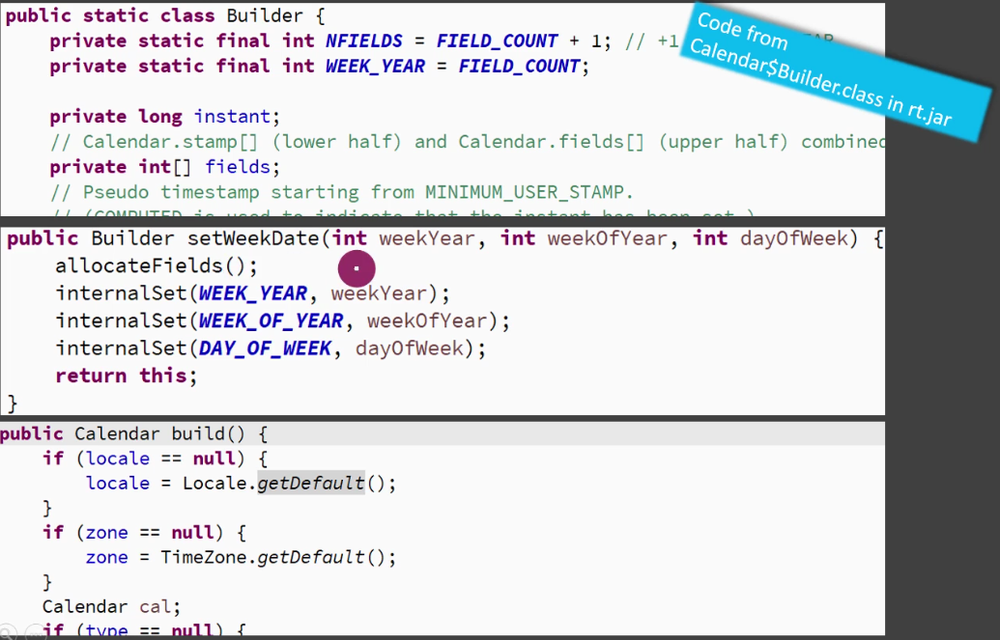

#### Builder - Comparison with Prototype

- Builder
  - Tenemos constructores complejos y `builder` nos permite trabajar con ese constructor.
  - Podemos crear `builder` como una clase separada, lo que nos permite trabajar con código legacy.
- Prototype
  - Nos permite evitar el uso de un constructor, ya que usa el método `clone()` para crear objetos.
  - En Java, este patrón trabaja usando el método `clone()`, y necesitaremos modificar el código existente, por lo que puede haber problemas con código legacy.

#### Builder - Pitfalls

Cuando hablamos de trampas de un patrón de diseño, estamos considerando cosas como el número de nuevas clases que tenemos que añadir, el impacto o esfuerzo requerido para refactorizar código existente, la complejidad para comprender un patrón. 

Teniendo en cuenta estas consideraciones, si patrón `builder` se implementa y se usa correctamente, entonces no tiene ningún problema.

Pero hay algunos problemas que podemos encontrarnos cuando trabajamos con este patrón:

- Es un poco complejo para nuevos programadores, principalmente debido al `method chaining`, donde los métodos de `builder` devuelven un objeto del mismo `builder`.
- Existe la posibilidad de un objeto parcialmente inicializado. El código del usuario puede asignar ninguna o algunas de las propiedades, usando los metodos `withXXX` y luego llamar al método `build()`. Si propiedades obligatorias no se asignan, el método `build()` debería proveer valores por defecto, o lanzar excepciones.

### Simple Factory

#### Simple Factory - Introduction

¿Qué problema resuelve `Simple Factory`? Varios tipos pueden instanciarse y la elección está basada en algunos criterios sencillos.

En este ejemplo vemos un típico caso de uso donde `simple factory` es normalmente usado.

```java
if (key.equalsIgnoreCase("pudding")) {
    // crear objeto pudding
} else if (key.equalsIgnoreCase("cake")) {
    // crear objeto cake
}
```

¿En qué consiste `simple factory`?

- Dado el ejemplo de arriba, `simple factory` consiste en mover la lógica de instanciación a una clase separada, y más comúnmente a un método estático de esa clase separada, ya que no necesitamos ninguna información de estado.
- Muchos desarrolladores no consideran `simple factory` un patrón de diseño, ya que es sencillamente un método que encapsula instanciaciones de objetos. Nada complejo va en ese método, solo comparamos una variable y, dependiendo de su valor, creamos un tipo de objeto diferente.
  - Realmente estamos estudiando `simple factory` porque es normalmente confundido con el patrón de diseño `factory method`.
- Usaremos `simple factory` si tenemos más de una opción para instanciar un objeto y se usa una lógica sencilla (comparar una variable con un valor por ejemplo) para elegir la clase correcta a partir de la cual instanciar ese objeto.

**UML**


- `Product`
  - Toma el rol `Product`.
  - Puede ser una interface o clase abstracta.
  - Necesitamos objetos de esta clase / subclases.
  - Muchas subclases pueden implementar esta interface o clase abstracta, en el diagrama vemos `ProductA` y `ProductB`.
- `SimpleFactory`
  - Toma el rol `Simple Factory`.
  - Provee un método estático que suele aceptar un parámetro y, dependiendo del valor de ese parámetro, obtendremos una instancia de las subclases del producto.

#### Simple Factory - Implementation Steps

Vamos a ver los pasos necesarios para implementar `simple factory`.

- Comenzamos creando una clase separada para nuestro `simple factory`.
  - Añadir un método que devuelva la instancia del objeto deseado.
    - Este método suele declararse estático y aceptará algún argumento que se usará para decidir de que clase instanciar el objeto.
    - Se pueden proveer argumentos adicionales que se usará para instanciar objetos.

#### Simple Factory - Implementation

En `src/java/com/jmunoz` creamos los paquetes/clases siguientes:

- `sec03`
  - `simplefactory`
    - `Post`: Es nuestra clase abstracta con rol `Product`. Representa un artículo que es publicado en un sitio web.
      - Se crean varias subclases de este rol `Product`.
    - `NewsPost`: Subclase de `Post`. Representa un artículo de noticias que es publicado es nuestro sitio web.
    - `BlogPost`: Subclase de `Post`. Representa un artículo publicado en nuestro blog.
    - `ProductPost`: Subclase de `Post`. Representa una página de información de un producto publicado en nuestro sitio web.
    - `PostFactory`: Toma el rol `Simple Factory`. Es la clase donde vamos a implementar el patrón `simple factory`.
      - Esta es la clase que se desarrolla en esta lección.
    - `Client`: Clase que usa nuestra implementación de `simple factory`.

#### Simple Factory - Implementation & Design Considerations

- Consideraciones de la implementación:
  - `Simple Factory` puede ser un método en una clase existente. Sin embargo, crear una clase separada permite a otras partes del código usar `simple factory` más fácilmente.
  - `Simple Factory` no necesita mantener estado, y por eso normalmente es mejor crear un método estático para instanciar nuestros objetos.
- Consideraciones de diseño:
  - `Simple Factory` puede utilizar a su vez otros patrones de diseño, como `builder`, para construir objetos.
  - En el caso de que se quieran especializar las subclases de `simple factory`, necesitaremos el patrón de diseño `factory method`.

#### Simple Factory - Example

Vamos a ver ejemplos del mundo real donde se usa `simple factory`.

- La clase `java.text.NumberFormat` tiene el método `getInstance()`, que es un ejemplo de `simple factory`.

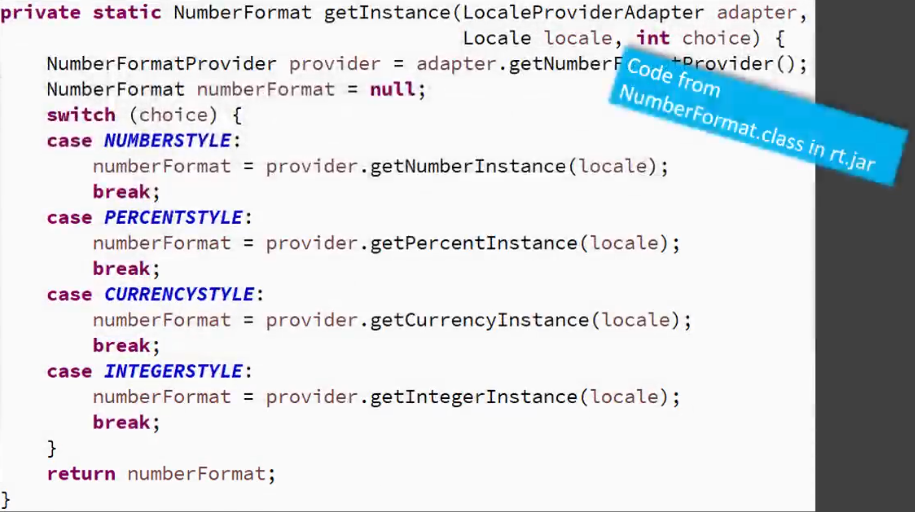

#### Simple Factory - Comparison with Factory Method

- `Simple Factory`
  - Sencillamente, movemos la lógica de instanciación fuera del código del cliente, normalmente a un método estático.
  - Conoce todas las clases cuyos objetos puede crear. 
- `Factory Method`
  - Es más útil cuando queremos delegar la decisión de creación de objetos a subclases.
  - `Factory Method` no conoce por adelantado todas las subclases del producto que pueden crearse porque la decisión sobre qué clase instanciarse se delega a las subclases.

#### Simple Factory - Pitfalls

- El criterio usado por `simple factory` para decidir qué objeto instanciar puede evolucionar en el tiempo, convirtiéndose en algo muy complejo. Si llegamos a esta situación, mejor usar el patrón de diseño `factory method`.

### Factory Method

#### Factory Method - Introduction

El patrón de diseño creacional `factory method` es uno de los más versátiles.

¿Por qué usamos `factory method`?

- Queremos mover la lógica de creación de objetos, que puede estar dispersa en nuestro código, para encapsularla en una clase separada.
- Es parecido a `simple factory`, pero `factory method` añade algo nuevo:
  - Cuando usamos el patrón `factory method`, no conocemos por adelantado que clase necesitamos instanciar. Podemos añadir nuevas clases en el futuro, que pueden ser instanciadas sin afectar a nuestro código cliente.
  - Se delega a las subclases la decisión de que objeto instanciar, esto se consigue haciendo `override` del `factory method` en las subclases.

**UML**

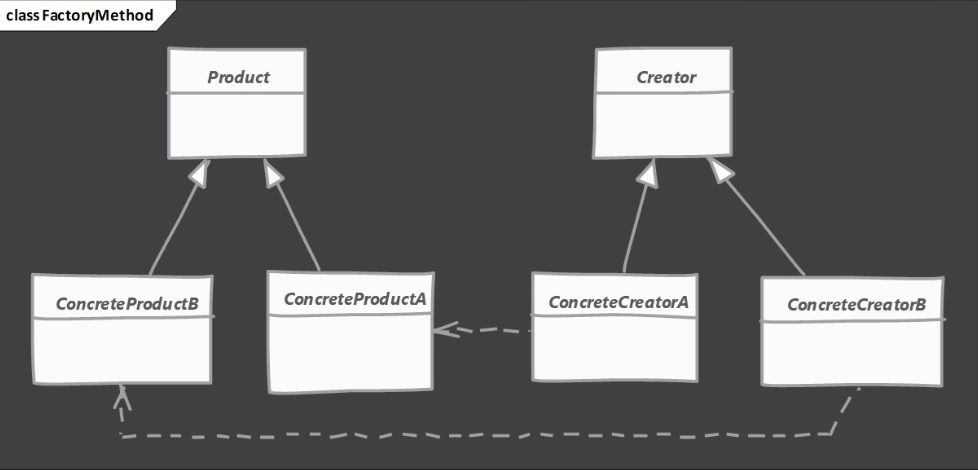

- `Product`: Toma el rol `Product`.
  - Es la clase base o interface de productos creados por `factory method`, es decir, vamos a crear objetos de subclases de esta interface o clase base de `Product`.
- `ConcreteProductA` y `ConcreteProductB`: Toman el rol `Concrete Product`.
  - Son las implementaciones de la interface o clase base de `Product`.
- `Creator`: Toma el rol `Creator`.
  - Declara un `factory method` abstracto, es decir, es donde el patrón de diseño `factory method` comienza a implementarse.
  - Adicionalmente, esta clase puede usar `factory method` para crear la instancia final de `Product`.
- `ConcreteCreatorA` y `ConcreteCreatorB`: Toman el rol de `Concrete Creator`.
  - Implementan (hacen `override`) `factory method` y devuelven una instancia concreta de `Product`.

#### Factory Method - Implementation Steps

- Comenzamos creando una clase para nuestro `Creator`.
  - `Creator` puede ser ya una clase concreta si puede proveer un objeto por defecto en su `factory method`, o puede ser una clase abstracta con un `factory method` abstracto.
  - Las implementaciones de la clase abstracta del `Creator` harán `override` del `factory method` abstracto y devolverán un objeto concreto.

#### Factory Method - Example UML

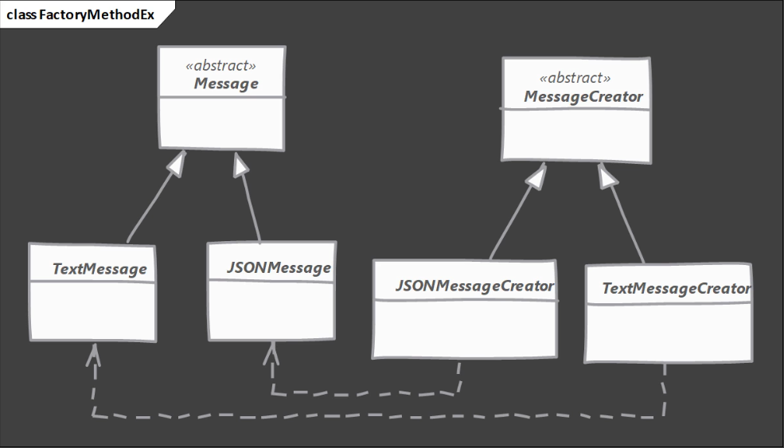

Indico el orden en que se implementa el patrón de diseño:

- `Message`: Clase que representa un mensaje en nuestro sistema. Toma el rol `Product`.
  - Es una interface, clase abstracta o también puede ser una clase base.
  - Queremos crear objetos de esta clase o de sus subclases.
- `TextMessage`: Toma el rol `Concrete Product`.
  - Subclase de `Message`. El contenido del mensaje se almacena como texto.
- `JSONMessage`: Toma el rol `Concrete Product`.
  - Subclase de `Message`. El contenido del mensaje se almacena como texto en formato JSON.
- `MessageCreator`: Toma el rol de `Creator`.
  - Es una clase abstracta que tiene definido un `factory method` donde se crearán objetos de alguna de las subclases arriba descritas.
- `TextMessageCreator`: Toma el rol `Concrete Creator`.
  - Implementación de `MessageCreator`.
  - Hace `override` del `factory method` que existe en `MessageCreator` para instanciar un objeto del tipo `TextMessage`.
- `JSONMessageCreator`: Toma el rol `Concrete Creator`. 
  - Implementación de `MessageCreator`.
  - Hace `override` del `factory method` que existe en `MessageCreator` para instanciar un objeto del tipo `JSONMessage`.

#### Factory Method - Implementation

En `src/java/com/jmunoz` creamos los paquetes/clases siguientes:

- `sec04`
  - `factorymethod`
    - `message`: Paquete con las clases que se quieren instanciar.
      - `Message`: Toma el rol `Product`. Es una clase abstracta y vamos a crear objetos de las subclases de `Message`.
      - `JSONMessage`: Toma el rol `Concrete Product`. Clase concreta que extiende de `Message`.
      - `TextMessage`: Toma el rol `Concrete Product`. Clase concreta que extiende de `Message`.
    - `MessageCreator`: Toma el rol `Creator`.
      - Clase abstracta que provee un `factory method` abstracto.
      - Esta clase se codifica en esta lección.
    - `JSONMessageCreator`: Toma el rol `Concrete Creator`.
      - Clase que implementa `MessageCreator` haciendo `override` del `factory method` y devolviendo un objeto de tipo `JSONMessage`.
      - Esta clase se codifica en esta lección.
    - `TextMessageCreator`: Toma el rol `Concrete Creator`.
      - Clase que implementa `MessageCreator` haciendo `override` del `factory method` y devolviendo un objeto de tipo `TextMessage`.
      - Esta clase se codifica en esta lección.
    - `Client`: Tiene un método `main()` donde usamos el patŕon de diseño `factory method`.

#### Factory Method - Implementation & Design Considerations

- Consideraciones de implementación:
  - El rol `Creator` puede ser una clase concreta y proveer una implementación por defecto para la implementación del `factory method`. En estos casos se creará un objeto `default` en el `Creator`.
  - También podemos aceptar argumentos adicionales como en `simple factory` para poder seleccionar entre distintos tipos de objeto. Las subclases harán `override` del `factory method` para, en función de diferentes criterios, crear diferentes objetos.
- Consideraciones del diseño:
  - En el patrón `factory method`, la jerarquía del rol `Creator` refleja la jerarquía del rol `Product`. Típicamente, tendremos un rol `Concrete Creator` por cada rol `Concrete Product`.
  - El patrón de diseño `template method` suele hacer uso de `factory methods`.
  - Otro patrón de diseño creacional llamado `abstract factory` también hace uso del patrón de diseño `factory method`.

#### Factory Method - Example

Vamos a ver ejemplos del mundo real donde se usa `factory method`.

- Las clases `java.util.Collection` y `java.util.AbstractCollection` tienen un método abstracto llamado `iterator()`. Este método es un ejemplo de `factory method`.
  - Las implementaciones `ArrayList`, `LinkedList`, etc., son las subclases de `AbstractCollection` que devuelven la instancia concreta al código del cliente.

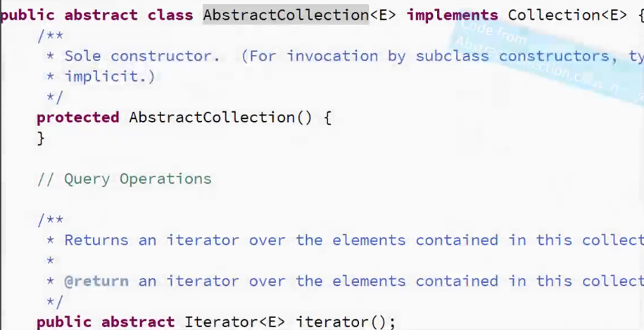

Recordar que la característica más definitoria del patrón de diseño `factory method` es que las **subclases proveen la instancia**.

Por tanto, métodos estáticos que devuelvan instancias de objetos NO son técnicamente `factory methods` tal y como se definen en `GoF`.

#### Factory Method - Pitfalls

- Es complejo de implementar. Hay más clases involucradas y necesitan `unit testing`.
- Se necesita comenzar con el patrón de diseño `factory method` desde el principio, es decir, no es fácil refactorizar código existente al patŕon `factory method`.
- A veces, este patrón nos fuerza a hacer subclases solo para crear las instancias apropiadas. Como ya vimos, un `Concrete Creator` por cada `Concrete Product`.