# JAVA DESIGN PATTERNS & SOLID PRINCIPLES

Vamos a estudiar principios SOLID y patrones de diseño.

## Project Setup


## SOLID Design Principles

Vamos a hablar de los principios SOLID.

SOLID es un acrónimo que representa cinco principios de diseño.

- Single Responsibility Principle.
- Open / Closed Principle.
- Liskov Substitution Principle.
- Interface Segregation Principle.
- Dependency Inversion Principle.

[Principios SOILD](../SOLID+Design+Principles.pdf)

### Single Responsibility Principle

**Nunca debería haber más de una razón para que una clase cambie.**

Esto significa que la clase debe proveer una funcionalidad muy focalizada o abordar una preocupación específica de nuestra funcionalidad deseada.

Al hacer una clase nos tenemos que preguntar ¿cuáles son las posibles razones para que esta clase tenga que cambiar? Si hay más de una razón, entonces no sigue este principio.


Si, por ejemplo, en una clase tenemos 3 responsabilidades distintas, entonces tenemos que separarlas en 3 clases, cada una gestionando una responsabilidad.

De esta forma, si algo cambia, nuestro código puede cambiarse de una manera organizada.

En `src/java/com/jmunoz` creamos los paquetes/clases siguientes:

- `sec01`
  - `singleresp`: Nuevo paquete para el principio de responsabilidad única.
    - `bad`: Nuevo paquete donde violamos el principio.
      - `UserController`: Simula un controller hecho en una aplicación Spring Web MVC.
      - `User`
      - `Store`: Clase que simula algo que se almacena en base de datos.
      - `Main`: Clase que prueba toda la funcionalidad de `UserController`.
    - `good`: Nuevo paquete donde seguimos el principio.
      - `UserController`: Simula un controller hecho en una aplicación Spring Web MVC.
      - `User`
      - `Store`: Clase que simula algo que se almacena en base de datos.
      - `Main`: Clase que prueba toda la funcionalidad de `UserController`.
      - `UserValidator`: Clase que contiene las validaciones.
      - `UserPersistenceService`: Clase que contiene la lógica para guardar en BD (en el ejemplo un HashMap)

Si queremos probar si un código o clase existente satisface el principio de responsabilidad único, tenemos que preguntarnos qué es lo que se supone que tiene que hacer la clase y qué es lo que está haciendo ahora mismo.

- En una aplicación MVC, un controller se supone que debe recibir peticiones de un cliente, entregarlas al resto de la aplicación para su procesamiento, obtener los resultados de ese procesamiento y devolver la respuesta al cliente.
- El controller no debe tener lógica de negocio en él.

Lo primero que tenemos que tener en cuenta a la hora de hacer algún cambio (refactor) es tener una buena batería de tests que prueben el código actual. Esto es porque no queremos introducir nuevos errores como resultado de la refactorizacion.

Nuestra clase `Main` sirve como clase de tests, pero en la vida real, necesitaremos usar la dependencia `JUnit` para crear tests.

Para hacer la refactorización, tenemos que identificar una responsabilidad que tenga la clase, en este caso `UserController`, que no debería tener.

Por ejemplo, la validación es algo que un controller no debe hacer. Entonces, creamos la clase `UserValidator` y nos llevamos ahí las validaciones. Nuestra clase `UserController` usará `UserValidator`.

Después de cada cambio, tenemos que ejecutar nuestros tests (en este ejemplo la clase `Main`) para comprobar que todo siga funcionando como antes de la refactorización.

**FAQ**

1. ¿Una utility class que contiene solo métodos estáticos viola SRP?

Una utility class es una colección de diferentes funciones. Así que, estrictamente hablando, si viola SRP.

En general, cuando se trata de métodos estáticos, la mayoría de los patrones y principios de POO quedan relegados a un segundo plano. Esto es porque un método estático no participa en ninguna característica importante de POO como la herencia, polimorfismo, etc.

Las utility classes son útiles para agrupar métodos reutilizables sin estado. Sin embargo, infringen tanto SRP como Open/Close.

La conclusión es que, para código reutilizable sin estado, se pueden usar utility classes. Sin embargo, deben diseñarse con cuidado para que los métodos estén al menos relacionados entre sí, como métodos de agrupación para trabajar con fechas, cadenas u otros tipos en una clase. Por lo tanto, incluso si violamos SRP y Open/Close, que exista al menos cierta cohesión. No crear nunca una única megaclase de utilidad donde se almacenan todos los métodos estáticos.

Estos métodos deben permanecer sin estado (no añadir variables non-final static que estos métodos utilicen o modifiquen) y siempre use métodos de utilidad solo si el método de instancia de una clase no tiene sentido, como último recurso.

2. En `UserController`, `UserValidator` es una variable local del método `createUser()`, mientras que `UserPersistanceStoreService` es un campo de `UserController`. ¿Cómo determinar si las clases recién creadas deben declararse como campos de Object o como variables locales en los métodos?

Es muy difícil establecer reglas precisas para esto, pero:

En general, si una variable se requiere en más de un método y ADEMÁS si su valor cambia durante la existencia del objeto y este cambio afecta también su comportamiento, podemos mantener la variable como un campo de esa clase.

Otro escenario estrechamente relacionado con el punto anterior es que el valor de la variable puede ser establecido por código externo tras la creación del objeto, y este nuevo valor es requerido por los métodos de dicho objeto para proporcionar funcionalidad. En este caso, la variable será un campo y otro código puede establecerlo mediante un setter. Para preservar ese valor para su uso posterior, se requiere un campo.

Un tercer escenario, no tan elegante, pero a veces práctico, es que el valor de la variable es costoso de establecer (por ejemplo, valor es un objeto nuevo cuya instanciación es costosa). Por lo tanto, aunque dicha variable pueda usarse en un solo método, la mantenemos como un campo para que las invocaciones posteriores de ese mismo método no requieran la creación/obtención de ese valor.

Las variables locales se utilizan si no tienen utilidad fuera del método, son económicas de crear y también si su estado después de su uso no es adecuado fuera de dicho método.

Tener en cuenta que estas no son las únicas condiciones para esta decisión, pero son algunas de las condiciones obvias para decidir entre un campo o una variable local.

Ahora, veamos nuestro ejemplo:

En muchas aplicaciones MVC del mundo real, el controlador recibe las dependencias requeridas, como el servicio de persistencia, mediante un contenedor IoC como Spring. Por lo tanto, normalmente encontrará controladores que declaran sus dependencias como campos, los cuales están conectados por algo como Spring.

Además, un servicio de persistencia se suele utilizar en más de un método, por ejemplo, guardar usuario, buscar un usuario, obtener todos los usuarios, etc.

Los validadores suelen ser objetos de bajo consumo, económicos de crear y no necesarios en todos los métodos. Por ejemplo, los métodos de búsqueda de usuario u obtención de todos los usuarios no requieren `UserValidator`.

Nuestro ejemplo de código no declara todos esos otros métodos, pero espero que esto aclare por qué necesitamos algunos objetos como campos y otros como variables locales.

3. En `UserValidator`, ver la línea `user.setName(user.getName().trim());`. `UserValidator` solo valida al usuario. No debería llamar a la función setter, ya que no forma parte de la validación.

¡Correcto!

Código como el anterior a veces se denomina "sanitización de entrada". Este código garantiza la seguridad de la entrada y elimina espacios en blanco y caracteres especiales añadidos inadvertidamente.

Marcar un espacio final como error de validación molestará a todos los usuarios, por lo que la mayoría de los sitios web sanearán al menos los espacios en blanco iniciales y finales antes de procesar la entrada para su validación. Normalmente, esto debería ocurrir en el lado del cliente, lo que significa que Angular/React o cualquier frontend que usemos debería realizar primero la `sanitization`. Sin embargo, el backend también debe realizar la misma `sanitization` como medida de seguridad. La razón es que algunos frontend nuevos podrían olvidar realizarla.

Siguiendo el SRP, un buen diseño consiste en tener una clase de `sanitization` de entrada adecuada cuya función sea SOLO tomar la entrada y sanitizarla por seguridad y conveniencia, eliminando espacios en blanco no deseados, caracteres especiales, etc. Sin embargo, en la vida real, la validación y la `sanitization` a menudo se combinan, ya que están relacionadas. Pero el punto sigue siendo válido: al menos en la lección sobre SRP, no deberían estar en la misma clase. Lo omitimos en nuestro ejemplo, ya que tener demasiadas clases complica los ejemplos para los nuevos usuarios.

### Open-Closed Principle

**Las entidades de software (clases, módulos, métodos, etc.) deben estar abiertas para la extensión, pero cerradas para la modificación**

Cuando decimos abierto para la extensión, significa que debemos ser capaces de extender el comportamiento existente.

Cuando decimos cerrado para la modificación, significa que el código que ya está escrito no debería tener que cambiarse.


Imaginemos que tenemos una clase base en Java que ya está escrita y probada. Si queremos extenderla o modificar el comportamiento de uno de sus métodos, debemos ser capaces de hacerlo usando **herencia**, es decir, creando una clase derivada y haciendo override del método.

Cerrado para la modificación significa que no deberíamos tener que modificar el código del método directamente en la clase base.

En `src/java/com/jmunoz` creamos los paquetes/clases siguientes:

- `sec01`
  - `openclosed`: Nuevo paquete para el principio de open-closed.
    - `bad`: Nuevo paquete donde violamos el principio.
      - `PhoneSubscriber`: Clase de suscriptores de una compañía telefónica.
        - Tiene un método `calculateBill()` y los campos que identifican un suscriptor.
      - `ISPSubscriber`: Clase de suscriptores a servicios de Internet.
        - Tiene un método `calculateBill()` y los campos que identifican un suscriptor.
      - `CallHistory`: Clase para llevar la cuenta del uso de data del móvil. No es importante para Open/Close y está para dar la sensación de una app completa.
      - `InternetSessionHistory`: Clase para llevar la cuenta del uso de data de Internet. No es importante para Open/Close y está para dar la sensación de una app completa.
    - `good`: Nuevo paquete donde seguimos el principio. En concreto eliminamos la duplicidad `calculateBill()`, pero además vemos que distintos tipos de subscriber básicamente solo tienen como diferencia la forma de calcular la factura.
      - `Subscriber`: Clase abstracta que representa un suscriptor. No indicamos de que es suscriptor.
        - Formada por los campos comunes que identifican un suscriptor en las clases `PhoneSubscriber` y `ISPSubscriber` y el cálculo de la factura (método abstracto).
        - Cerrada para modificación.
      - `PhoneSubscriber`: Clase de suscriptores de una compañía telefónica.
        - Ahora extiende de `Subscriber` y solo implementa el método `calculateBill()`, abierto a extensión.
      - `ISPSubscriber`: Clase de suscriptores a servicios de Internet.
        - Ahora extiende de `Subscriber` y solo implementa el método `calculateBill()`, abierto a extensión.
      - `CallHistory`: Clase para llevar la cuenta del uso de data del móvil. No es importante para Open/Close y está para dar la sensación de una app completa.
      - `InternetSessionHistory`: Clase para llevar la cuenta del uso de data de Internet. No es importante para Open/Close y está para dar la sensación de una app completa.

Por tanto, lo que hemos hecho ha sido coger todo lo que hay común en clases y que no va a cambiar, en nuestro ejemplo la entidad de Subscriber. Hemos hecho una clase base (abstracta) `Subscriber` cuya idea es que esté cerrada para modificación.

Hemos creado en esa clase abstracta un método abstracto `calculateBill()` para que otras clases que hereden de `Subscriber` puedan extender el comportamiento de ese cálculo de factura a como se necesite.

### Liskov Substitution Principle

**Debemos poder sustituir objetos de clase base con objetos de clase hija y esto no debe alterar el comportamiento / características del programa.**

Si el objeto clase base provee un comportamiento específico y es sustituido por un objeto clase hijo, ese comportamiento debe ser el mismo.

En `src/java/com/jmunoz` creamos los paquetes/clases siguientes:

- `sec01`
  - `liskov`: Nuevo paquete para el principio de sustitución de Liskov.
    - `bad`: Nuevo paquete donde violamos el principio.
      - `Rectangle`: Clase rectángulo.
      - `Square`: Clase cuadrado. Es un tipo especial de rectángulo y extiende de él.
        - Podemos decir que un cuadrado es un rectángulo, si los campos width y height tienen el mismo valor.
      - `Main`: Clase principal para hacer las pruebas.
        - Para ejecutar y ver las aserciones, ir a la configuración de ejecución e indicar en los argumentos VM `-ea`.
        - 
        - Al ejecutar vemos que falla un test cuando se pasa a `useRectangle()` un cuadrado. Esto es porque en un cuadrado width y height tienen que tener el mismo valor, y ya no cumple los valores indicados en `useRectangle()`.
        - No se cumple Liskov.
    - `good`: Nuevo paquete donde seguimos el principio. Tenemos que romper la relación `Square extends Rectangle` porque cuando hablamos de programación orientada a objetos, un cuadrado NO es un rectángulo.
      - `Shape`: Interface con un solo comportamiento definido en ella, `computeArea()`.
      - `Rectangle`: Clase rectángulo que implementa `Shape`.
      - `Square`: Clase cuadrado que implementa `Shape`.
      - `Main`: Clase principal para hacer las pruebas.
        - Ahora el método `useRectangle()` solo aplica a rectángulos, para evitar violar el principio Liskov.
        - Para ejecutar y ver las aserciones, ir a la configuración de ejecución e indicar en los argumentos VM `-ea`.

### Interface Segregation Principle

**Los clientes no deber ser forzados a depender de interfaces que no usan**

En particular hablamos de métodos, es decir, los clientes no deberían tener que depender de métodos que están definidos en interfaces, pero que no usan.

Existe un término llamado `interface pollution` que significa que no deberíamos hacer nuestras interfaces muy grandes, atiborradas de métodos no relacionados entre sí y que luego nuestras clases implementen esa interface.

Una forma muy fácil de ver que este principio es violado, es buscar:

- Clases que tienen implementaciones de métodos vacías, sin código.
- Métodos que lanzan la excepción `UnsupportedOperationException` (o similar).
- Implementaciones de métodos que devuelven null o valores por defecto / dummy.

En todos estos casos, al final hablamos de métodos que no tienen sentido para esa clase en particular.

La solución para esto consiste en romper esas interfaces tan grandes en otras interfaces más pequeñas, pero no de cualquier modo.

Los métodos o comportamientos o contratos que estén definidos en estas nuevas interfaces más pequeñas deben estar relacionados entre ellos. Buscamos cohesión, porque no queremos que una clase esté forzada a proveer una implementación de un método que para esa clase no tiene sentido.

En `src/java/com/jmunoz` creamos los paquetes/clases siguientes:

- `sec01`
  - `segregation`: Nuevo paquete para el principio de segregación de interfaces.
    - `bad`
      - `entity`:
        - `Entity`: Clase base para nuestras entidades JPA.
        - `User`: Clase que extiende de `Entity`.
        - `Order`: Clase que extiende de `Entity`.
      - `service`:
        - `PersistenceService`: Interface común para las operaciones de persistencia.
          - Tenemos `save()`, `delete()`, `findById()` y `findByName()`. 
        - `UserPersistenceService`: Clase que realiza operaciones de persistencia para un `User`.
          - Tenemos `save()`, `delete()`, `findById()` y `findByName()` y las utilizamos todas. 
        - `OrderPersistenceService`: Clase que realiza operaciones de persistencia para un `User`.
          - Tenemos `save()`, `delete()` y `findById()`.
          - El método `findByName()` no tiene sentido para un pedido, y lanza una excepción `UnsupportedOperationException`.
          - No cumple el principio de segregación de interfaces.
    - `good`
      - `entity`:
        - `Entity`: Clase base para nuestras entidades JPA.
        - `User`: Clase que extiende de `Entity`.
        - `Order`: Clase que extiende de `Entity`.
      - `service`:
        - `PersistenceService`: Interface común para las operaciones de persistencia.
          - Tenemos `save()`, `delete()` y `findById()`.
          - Ya no tenemos `findByName()`. Como es solo un método no creamos otra interface.
        - `UserPersistenceService`: Clase que realiza operaciones de persistencia para un `User`.
          - Tenemos `save()`, `delete()` y `findById()`.
          - `findByName()` la creamos para esta clase.
        - `OrderPersistenceService`: Clase que realiza operaciones de persistencia para un `User`.
          - Tenemos `save()`, `delete()` y `findById()`.
          - Ya no tenemos que implementar `findByName()`, porque no aparece en la interface.

### Dependency Inversion Principle

Este principio viene en dos partes diferentes:

**A: Los módulos de alto nivel no deben depender de módulos de bajo nivel. Ambos deben depender de abstracciones**

**B: Las abstracciones no deben depender de los detalles. Los detalles deben depender de abstracciones**

Cuando decimos módulo de alto nivel, queremos decir un módulo que provee o implementa reglas de negocio.

Cuando decimos módulo de bajo nivel, queremos indicar una funcionalidad que es tan básica que puede usarse en cualquier sitio, por ejemplo, escribir en disco o convertir un objeto Java en Json.

Una abstracción es algo tan sencillo como una interface.

Por último, tenemos que entender es que es una `dependencia`.


Para esta función, las dependencias son `JSONFormatter()` y `FileWriter()`. Es decir, una dependencia es algo que necesitamos para proveer la funcionalidad que queremos a nuestro código.

Cuando hablamos de inversión de dependencias, hablamos de hacer lo contrario a lo que normalmente hacemos.

Lo que normalmente hacemos para crear una dependencia, tal y como podemos ver en la imagen, es crear un objeto usando el operador `new`.

El problema de usar `new` es que produce un acople fuerte de esa implementación en particular, y cualquier cambio en los requerimientos va a hacer que tengamos que modificar el código, lo que puede producir errores.

Para evitar esto es para lo que usamos la inversión de dependencias.

En vez de crear una instancia de un Object Mapper o de un FileWriter usando `new`, podemos usar dos interfaces, `Writer` y `Formatter`, por ejemplo, y escribiremos nuestro módulo de alto nivel usando esa interface.


Vemos en esta imagen que, en vez de usar `new`, aceptamos parámetros de esas interfaces y escribimos nuestro código usando estas interfaces.

De repente, nuestro código ya no queda fuertemente acoplado a ninguna clase concreta.

En vez de instanciar las dependencias nosotros, es otra cosa la las crea y nos da las dependencias.

En `src/java/com/jmunoz` creamos los paquetes/clases siguientes:

- `sec01`
  - `di`: Nuevo paquete para el principio de inversión de dependencias.
    - `bad`
      - `MessagePrinter`: Clase que recibe un objeto `Message` y un nombre de fichero, lo convierte a formato JSON y lo escribe en disco.
        - Tiene dependencias que hacen el código fuertemente acoplado a esas implementaciones (`JSONFormatter()` y `PrintWritter()`).
      - `Message`: Solo para completar la app.
      - `TextFormatter`: Solo para completar la app.
      - `FormatException`: Solo para completar la app.
      - `Formatter`: Solo para completar la app.
      - `JSONFormatter`: Solo para completar la app.
      - `Main`: Clase principal para las pruebas.
    - `good`
      - `MessagePrinter`: Clase que recibe un objeto `Message`, un objeto `Formatter` y un objeto `PrintWritter` para convertir el mensaje a formato JSON y escribirlo en disco.
        - Usa inversión de dependencias que hacen que el código no quede acoplado a implementaciones concretas.
      - `Message`: Solo para completar la app.
      - `TextFormatter`: Solo para completar la app.
      - `FormatException`: Solo para completar la app.
      - `Formatter`: Solo para completar la app.
      - `JSONFormatter`: Solo para completar la app.
      - `Main`: Clase principal para las pruebas. Crea y pasa las instancias de `Formatter` y `PrintWritter`.

## Creational Design Patterns

Los patrones de diseño creacionales tratan con la creación de objetos de clases.

¿Por qué necesitamos patrones de diseño para crear un objeto de una clase? ¿No podemos usar el operador `new` y ya está?

Si, pero hay muchos requisitos adicionales que tienen lugar cuando estamos desarrollando una aplicación real.

Por ejemplo, nuestro objeto podría necesitar muchos otros objetos antes de que pueda crearse, o puede necesitar muchos pasos para poder crearse, como leer data de un fichero o hacer una query para leer de BD y de ahí crear el objeto final.

Otro requerimiento posible es que solo pueda existir un objeto de esa clase en toda la aplicación, porque esa clase puede ser una configuración.

Estos son los patrones de diseño creacionales que vamos a ver en el curso:

- Builder
- Simple Factory
- Factory Method
- Prototype
- Singleton
- Abstract Factory
- Object Pool

### Builder

#### Builder - Introduction

Es un patrón de diseño creacional. Usaremos `builder` cuando queramos construir objetos de una clase.

¿Qué problema resuelve el patrón de diseño `builder`?

**1. Los constructores de una clase requieren mucha información.**


Aquí tenemos una clase llamada `Product` y digamos que tenemos un requerimiento que dice que los objetos de esta clase deben ser inmutables.

Un objeto inmutable significa que su estado o propiedades no pueden cambiarse una vez que el objeto se ha creado. Un ejemplo es la clase `String`, cuyos objetos son inmutables.

Cuando escribimos clases inmutables, normalmente terminamos haciendo constructores con varios parámetros, ya que tenemos que proveer toda la información de estado para el objeto en el mismo constructor.

Tener un método o constructor que necesita muchos argumentos es considerado una mala práctica, ya que cualquiera que use ese código tiene que descubrir que significa cada parámetro para poder pasar el valor correcto en la secuencia correcta.

Si nuestros argumentos son similares o del mismo tipo de dato, el problema es todavía más grande.

En el ejemplo de la imagen, tenemos que pasar varios valores numéricos. Aunque parezca que el nombre del parámetro sirve como documentación puede que distribuyamos el código de manera ya compilada en un fichero `jar` a otros desarrolladores, por lo que no tienen acceso a los nombres de los argumentos esperados.

Aquí es donde el patrón de diseño `builder` puede ayudarnos.

- Hace más fácil usar constructores para crear objetos de la clase.
- Evitan construir constructores innecesarios e igualmente tener objetos inmutables.

**2. Objetos que necesitan otros objetos o "partes" para construirlos.**


En este ejemplo tenemos las clases `Address` y `User`. Si vemos la clase `User` vemos que necesitamos un objeto de tipo `Address` y una lista de `Role` para poder crear mi objeto de tipo `User`.

Podemos pensar en los objetos `Address` y `Role` como las partes que utilizamos para montar nuestro objeto `User`.

Hay ciertos pasos que tenemos que seguir, como son la creación del objeto `Address`, varios objetos `Role` y la creación de una colección que los contenga, antes de poder llamar a nuestro constructor para crear un objeto `User`.

En estos casos también es muy útil el patrón `builder`.

**Por tanto, ¿cuándo y cómo usaremos el patrón de diseño `Builder`?**

- Cuando para construir un objeto es necesario seguir un proceso complejo que conlleva muchos pasos.
  - Complejo se refiere a una gran cantidad de argumentos que el constructor necesita o a una gran cantidad de pasos necesarios para poder crear un objeto.
- En `builder` eliminamos del código del cliente la lógica relacionada con la construcción del objeto y lo abstraemos en clases separadas, de forma que el cliente de nuestro objeto pueda crear esos objetos fácilmente.

**UML**


Vemos que existen 4 roles diferentes en este patrón de diseño.

- Rol - Product
  - Clase Product: Queremos crear objetos (que son complejos) de esta clase. Es el resultado final que queremos construir.
  - Product se refiere a algo final, no a un producto físico como un IPhone.
- Rol - Builder
  - Es una interface para crear las ¨partes" de nuestro objeto Product.
  - También provee un método `build()` para instanciar el objeto final.
  - También pueden proveer un método, `getProduct()` en nuestro ejemplo, que pueden usar los desarrolladores para consultar un objeto construido.
- Rol - ConcreteBuilder
  - Es la implementación del rol Builder. 
  - Construye las distintas partes y monta el product final.
  - Opcionalmente, puede mantener la traza de los product creados.
- Rol - Director
  - Es quien llama a los métodos descritos en el rol Builder.
  - Usa el rol Builder para construir un objeto.
  - Conoce los pasos y la secuencia para construir un product.

#### Builder - Implementation Steps

Vamos a ver los pasos necesarios cuando queremos implementar un `Builder` en nuestro código:

- Comenzamos creando el `builder`.
  - Identificamos las "partes" (y/o los pasos) del producto y proveemos métodos para crear esas partes.
  - Debemos proveer un método para montar o construir, llamado normalmente `build()`, el producto/objeto.
  - Debemos proveer una forma o método para consultar un objeto ya construido.
  - Opcionalmente, `builder` puede mantener una referencia al producto construido, de tal forma que pueda ser consultado de nuevo en el futuro.
- Necesitamos un director, que puede ser una clase separada (esto es más raro), o bien el cliente puede tener el rol de director también (lo más normal).

#### Builder - Example UML

Este es el UML del ejemplo de patrón de diseño `Builder` que vamos a construir en Java.


- `UserDTO`: Es una interface DTO (data transfer object).
- `UserWebDTO` Es una implementación concreta de `UserDTO`. Es lo que queremos construir, nuestro producto final. Es el rol `Product`.
- `UserWebDTOBuilder`: Es la clase que usaremos para crear `UserWebDTO`. Implementa `UserDTOBuilder`. Es el rol `ConcreteBuilder`.
- `UserDTOBuilder`: Es una interface o clase abstracta que sencillamente define los métodos que corresponden a cada "parte" del objeto `UserDTO`. Es el rol `Builder`.
- `Client`: Es nuestra clase principal con método `main`. Es el rol `Director`.
- Las clases que pueden verse en color naranja son ejemplos de como podemos mejorar aún más este ejemplo. `UserRESTDTOBuilder` es otra implementación de `UserDTOBuilder` que podemos usar para construir otro tipo de objeto, `UserRESTDTO`.
  - Es un ejemplo de como podemos extender el patrón de diseño `Builder`.

#### Builder - Implementation

En `src/java/com/jmunoz` creamos los paquetes/clases siguientes:

- `sec02`
  - `builder`
    - `Address`: Clase normal usada en `User` para almacenar información de la dirección del usuario.
    - `User`: Clase Entity usada para construir el DTO. Este objeto lo obtendríamos desde una capa de persistencia, con data almacenada en BD.
    - `UserDTO`: Interface DTO.
    - `UserWebDTO`: Implementación de `UserDTO`. Cumple el rol `Product`, producto final a obtener del patrón `builder`. Vamos, lo que queremos construir.
    - `UserDTOBuilder`: Es una interface que provee los métodos necesarios para montar cada "parte" de nuestro objeto `UserDTO`. Es el rol `Builder`.
      - Cada uno de estos métodos devuelve una referencia a sí mismo (al builder), así que usaremos este tipo de implementación para usar `method chaining`.
      - El método `build()` es el que monta el objeto final.
    - `UserWebDTOBuilder`: Es una implementación concreta de `UserDTOBuilder`. Es el rol `ConcreteBuilder`.
      - Es lo que realmente construimos en esta clase.
    - `Client`: Es nuestra clase principal con el rol de `Director` que usa el builder `UserDTOBuilder`.

#### Builder - Implementation 2

Vamos a ver otra forma muy común de implementar el patrón `builder` en el mundo real.

En `src/java/com/jmunoz` creamos los paquetes/clases siguientes:

- `sec02`
  - `builder2`
    - `Address`: Clase normal usada en `User` para almacenar información de la dirección del usuario.
    - `User`: Clase Entity usada para construir el DTO. Este objeto lo obtendríamos desde una capa de persistencia, con data almacenada en BD.
    - `UserDTO`: Interface DTO. Cumple el rol de `Product`. Queremos crear objetos de esta clase.
      - No tenemos constructor, pero vamos a construir una instancia inmutable, usando métodos getter public y métodos setter private.
      - Es decir, esta forma de implementar el `builder` evita tener que tratar con constructores complejos.
      - Declaramos nuestro `builder` como una `inner static class`. Es decir, nuestro `builder` está contenido dentro de la clase cuyo objeto va a construir. Como es una clase interna, puede usar los métodos setter private.
      - Seguimos teniendo métodos para construir las partes de nuestro objeto.
      - Algo que también es común, pero no obligatorio, es un método estático dentro de nuestra clase `Product`, llamado `getBuilder()`, que devuelve una nueva instancia de nuestro `builder`. 
    - `Client`: Es nuestra clase principal con el rol de `Director` que usa el método estático `getBuilder()`.

#### Builder - Implementation & Design Considerations

- Consideraciones de la implementación
  - Podemos crear fácilmente una clase inmutable implementando `builder` como una `inner static class`. Esta forma de implementación es usada muy frecuentemente incluso aunque la inmutabilidad no sea lo que se esté buscando.
- Consideraciones de diseño
  - El rol de `director` no se suele implementar como una clase separada. Típicamente, el consumer de la instancia del objeto o el cliente toman ese rol.
  - Un `Abstract builder` tampoco es requerido si el `product` mismo no es parte de ninguna jerarquía de herencia. Se puede crear directamente el `concrete builder`.
  - Si tenemos el problema de "muchos argumentos en el constructor", este es una buena indicación de que el patrón `builder` puede ser de ayuda.

#### Builder - Examples

Vamos a ver aplicaciones del mundo real donde se ha aplicado el patrón de diseño `builder`. En concreto, vamos a ver clases que vienen en el JDK o clases que están presentes en Spring.

- La clase `java.lang.StringBuilder` al igual que otras clases buffer en el paquete `java.nio`, como `ByteBuffer`, `CharBuffer` son ejemplos típicos de patrón `builder`.
  - Aunque estos son ejemplos del patrón `builder`, no cuadran al 100% con la definición de `GoF` (libro de Gang Of Four). Estas clases nos permiten construir un objeto final mediante pasos, proveyendo solo una parte de un objeto final en cada paso. En este sentido, sí que pueden verse como una implementación del patrón `builder`.
  - Así que `StringBuilder` satisface el propósito del patrón `builder`. Sin embargo, cuando empezamos a mirar la estructura de `StringBuilder`, vemos que algo no cuadra. La definición de `GoF` también indica que `builder` tiene el potencial de construir diferentes representaciones de la interface de `product` usando los mismos pasos (`product` puede tener muchas subclases que pueden construirse usando nuestro `builder` con los mismos pasos)
- Un ejemplo de patrón `builder` que si lo es al 100% es la clase de Java 8 `java.util.Calendar.Builder`.


#### Builder - Comparison with Prototype

- Builder
  - Tenemos constructores complejos y `builder` nos permite trabajar con ese constructor.
  - Podemos crear `builder` como una clase separada, lo que nos permite trabajar con código legacy.
- Prototype
  - Nos permite evitar el uso de un constructor, ya que usa el método `clone()` para crear objetos.
  - En Java, este patrón trabaja usando el método `clone()`, y necesitaremos modificar el código existente, por lo que puede haber problemas con código legacy.

#### Builder - Pitfalls

Cuando hablamos de trampas de un patrón de diseño, estamos considerando cosas como el número de nuevas clases que tenemos que añadir, el impacto o esfuerzo requerido para refactorizar código existente, la complejidad para comprender un patrón. 

Teniendo en cuenta estas consideraciones, si patrón `builder` se implementa y se usa correctamente, entonces no tiene ningún problema.

Pero hay algunos problemas que podemos encontrarnos cuando trabajamos con este patrón:

- Es un poco complejo para nuevos programadores, principalmente debido al `method chaining`, donde los métodos de `builder` devuelven un objeto del mismo `builder`.
- Existe la posibilidad de un objeto parcialmente inicializado. El código del usuario puede asignar ninguna o algunas de las propiedades, usando los metodos `withXXX` y luego llamar al método `build()`. Si propiedades obligatorias no se asignan, el método `build()` debería proveer valores por defecto, o lanzar excepciones.

### Simple Factory

#### Simple Factory - Introduction

¿Qué problema resuelve `Simple Factory`? Varios tipos pueden instanciarse y la elección está basada en algunos criterios sencillos.

En este ejemplo vemos un típico caso de uso donde `simple factory` es normalmente usado.

```java
if (key.equalsIgnoreCase("pudding")) {
    // crear objeto pudding
} else if (key.equalsIgnoreCase("cake")) {
    // crear objeto cake
}
```

¿En qué consiste `simple factory`?

- Dado el ejemplo de arriba, `simple factory` consiste en mover la lógica de instanciación a una clase separada, y más comúnmente a un método estático de esa clase separada, ya que no necesitamos ninguna información de estado.
- Muchos desarrolladores no consideran `simple factory` un patrón de diseño, ya que es sencillamente un método que encapsula instanciaciones de objetos. Nada complejo va en ese método, solo comparamos una variable y, dependiendo de su valor, creamos un tipo de objeto diferente.
  - Realmente estamos estudiando `simple factory` porque es normalmente confundido con el patrón de diseño `factory method`.
- Usaremos `simple factory` si tenemos más de una opción para instanciar un objeto y se usa una lógica sencilla (comparar una variable con un valor por ejemplo) para elegir la clase correcta a partir de la cual instanciar ese objeto.

**UML**


- `Product`
  - Toma el rol `Product`.
  - Puede ser una interface o clase abstracta.
  - Necesitamos objetos de esta clase / subclases.
  - Muchas subclases pueden implementar esta interface o clase abstracta, en el diagrama vemos `ProductA` y `ProductB`.
- `SimpleFactory`
  - Toma el rol `Simple Factory`.
  - Provee un método estático que suele aceptar un parámetro y, dependiendo del valor de ese parámetro, obtendremos una instancia de las subclases del producto.

#### Simple Factory - Implementation Steps

Vamos a ver los pasos necesarios para implementar `simple factory`.

- Comenzamos creando una clase separada para nuestro `simple factory`.
  - Añadir un método que devuelva la instancia del objeto deseado.
    - Este método suele declararse estático y aceptará algún argumento que se usará para decidir de que clase instanciar el objeto.
    - Se pueden proveer argumentos adicionales que se usará para instanciar objetos.

#### Simple Factory - Implementation

En `src/java/com/jmunoz` creamos los paquetes/clases siguientes:

- `sec03`
  - `simplefactory`
    - `Post`: Es nuestra clase abstracta con rol `Product`. Representa un artículo que es publicado en un sitio web.
      - Se crean varias subclases de este rol `Product`.
    - `NewsPost`: Subclase de `Post`. Representa un artículo de noticias que es publicado es nuestro sitio web.
    - `BlogPost`: Subclase de `Post`. Representa un artículo publicado en nuestro blog.
    - `ProductPost`: Subclase de `Post`. Representa una página de información de un producto publicado en nuestro sitio web.
    - `PostFactory`: Toma el rol `Simple Factory`. Es la clase donde vamos a implementar el patrón `simple factory`.
      - Esta es la clase que se desarrolla en esta lección.
    - `Client`: Clase que usa nuestra implementación de `simple factory`.

#### Simple Factory - Implementation & Design Considerations

- Consideraciones de la implementación:
  - `Simple Factory` puede ser un método en una clase existente. Sin embargo, crear una clase separada permite a otras partes del código usar `simple factory` más fácilmente.
  - `Simple Factory` no necesita mantener estado, y por eso normalmente es mejor crear un método estático para instanciar nuestros objetos.
- Consideraciones de diseño:
  - `Simple Factory` puede utilizar a su vez otros patrones de diseño, como `builder`, para construir objetos.
  - En el caso de que se quieran especializar las subclases de `simple factory`, necesitaremos el patrón de diseño `factory method`.

#### Simple Factory - Example

Vamos a ver ejemplos del mundo real donde se usa `simple factory`.

- La clase `java.text.NumberFormat` tiene el método `getInstance()`, que es un ejemplo de `simple factory`.


#### Simple Factory - Comparison with Factory Method

- `Simple Factory`
  - Sencillamente, movemos la lógica de instanciación fuera del código del cliente, normalmente a un método estático.
  - Conoce todas las clases cuyos objetos puede crear. 
- `Factory Method`
  - Es más útil cuando queremos delegar la decisión de creación de objetos a subclases.
  - `Factory Method` no conoce por adelantado todas las subclases del producto que pueden crearse porque la decisión sobre qué clase instanciarse se delega a las subclases.

#### Simple Factory - Pitfalls

- El criterio usado por `simple factory` para decidir qué objeto instanciar puede evolucionar en el tiempo, convirtiéndose en algo muy complejo. Si llegamos a esta situación, mejor usar el patrón de diseño `factory method`.

### Factory Method

#### Factory Method - Introduction

El patrón de diseño creacional `factory method` es uno de los más versátiles.

¿Por qué usamos `factory method`?

- Queremos mover la lógica de creación de objetos, que puede estar dispersa en nuestro código, para encapsularla en una clase separada.
- Es parecido a `simple factory`, pero `factory method` añade algo nuevo:
  - Cuando usamos el patrón `factory method`, no conocemos por adelantado que clase necesitamos instanciar. Podemos añadir nuevas clases en el futuro, que pueden ser instanciadas sin afectar a nuestro código cliente.
  - Se delega a las subclases la decisión de que objeto instanciar, esto se consigue haciendo `override` del `factory method` en las subclases.

**UML**


- `Product`: Toma el rol `Product`.
  - Es la clase base o interface de productos creados por `factory method`, es decir, vamos a crear objetos de subclases de esta interface o clase base de `Product`.
- `ConcreteProductA` y `ConcreteProductB`: Toman el rol `Concrete Product`.
  - Son las implementaciones de la interface o clase base de `Product`.
- `Creator`: Toma el rol `Creator`.
  - Declara un `factory method` abstracto, es decir, es donde el patrón de diseño `factory method` comienza a implementarse.
  - Adicionalmente, esta clase puede usar `factory method` para crear la instancia final de `Product`.
- `ConcreteCreatorA` y `ConcreteCreatorB`: Toman el rol de `Concrete Creator`.
  - Implementan (hacen `override`) `factory method` y devuelven una instancia concreta de `Product`.

#### Factory Method - Implementation Steps

- Comenzamos creando una clase para nuestro `Creator`.
  - `Creator` puede ser ya una clase concreta si puede proveer un objeto por defecto en su `factory method`, o puede ser una clase abstracta con un `factory method` abstracto.
  - Las implementaciones de la clase abstracta del `Creator` harán `override` del `factory method` abstracto y devolverán un objeto concreto.

#### Factory Method - Example UML


Indico el orden en que se implementa el patrón de diseño:

- `Message`: Clase que representa un mensaje en nuestro sistema. Toma el rol `Product`.
  - Es una interface, clase abstracta o también puede ser una clase base.
  - Queremos crear objetos de esta clase o de sus subclases.
- `TextMessage`: Toma el rol `Concrete Product`.
  - Subclase de `Message`. El contenido del mensaje se almacena como texto.
- `JSONMessage`: Toma el rol `Concrete Product`.
  - Subclase de `Message`. El contenido del mensaje se almacena como texto en formato JSON.
- `MessageCreator`: Toma el rol de `Creator`.
  - Es una clase abstracta que tiene definido un `factory method` donde se crearán objetos de alguna de las subclases arriba descritas.
- `TextMessageCreator`: Toma el rol `Concrete Creator`.
  - Implementación de `MessageCreator`.
  - Hace `override` del `factory method` que existe en `MessageCreator` para instanciar un objeto del tipo `TextMessage`.
- `JSONMessageCreator`: Toma el rol `Concrete Creator`. 
  - Implementación de `MessageCreator`.
  - Hace `override` del `factory method` que existe en `MessageCreator` para instanciar un objeto del tipo `JSONMessage`.

#### Factory Method - Implementation

En `src/java/com/jmunoz` creamos los paquetes/clases siguientes:

- `sec04`
  - `factorymethod`
    - `message`: Paquete con las clases que se quieren instanciar.
      - `Message`: Toma el rol `Product`. Es una clase abstracta y vamos a crear objetos de las subclases de `Message`.
      - `JSONMessage`: Toma el rol `Concrete Product`. Clase concreta que extiende de `Message`.
      - `TextMessage`: Toma el rol `Concrete Product`. Clase concreta que extiende de `Message`.
    - `MessageCreator`: Toma el rol `Creator`.
      - Clase abstracta que provee un `factory method` abstracto.
      - Esta clase se codifica en esta lección.
    - `JSONMessageCreator`: Toma el rol `Concrete Creator`.
      - Clase que implementa `MessageCreator` haciendo `override` del `factory method` y devolviendo un objeto de tipo `JSONMessage`.
      - Esta clase se codifica en esta lección.
    - `TextMessageCreator`: Toma el rol `Concrete Creator`.
      - Clase que implementa `MessageCreator` haciendo `override` del `factory method` y devolviendo un objeto de tipo `TextMessage`.
      - Esta clase se codifica en esta lección.
    - `Client`: Tiene un método `main()` donde usamos el patŕon de diseño `factory method`.

#### Factory Method - Implementation & Design Considerations

- Consideraciones de implementación:
  - El rol `Creator` puede ser una clase concreta y proveer una implementación por defecto para la implementación del `factory method`. En estos casos se creará un objeto `default` en el `Creator`.
  - También podemos aceptar argumentos adicionales como en `simple factory` para poder seleccionar entre distintos tipos de objeto. Las subclases harán `override` del `factory method` para, en función de diferentes criterios, crear diferentes objetos.
- Consideraciones del diseño:
  - En el patrón `factory method`, la jerarquía del rol `Creator` refleja la jerarquía del rol `Product`. Típicamente, tendremos un rol `Concrete Creator` por cada rol `Concrete Product`.
  - El patrón de diseño `template method` suele hacer uso de `factory methods`.
  - Otro patrón de diseño creacional llamado `abstract factory` también hace uso del patrón de diseño `factory method`.

#### Factory Method - Example

Vamos a ver ejemplos del mundo real donde se usa `factory method`.

- Las clases `java.util.Collection` y `java.util.AbstractCollection` tienen un método abstracto llamado `iterator()`. Este método es un ejemplo de `factory method`.
  - Las implementaciones `ArrayList`, `LinkedList`, etc., son las subclases de `AbstractCollection` que devuelven la instancia concreta al código del cliente.


Recordar que la característica más definitoria del patrón de diseño `factory method` es que las **subclases proveen la instancia**.

Por tanto, métodos estáticos que devuelvan instancias de objetos NO son técnicamente `factory methods` tal y como se definen en `GoF`.

#### Factory Method - Pitfalls

- Es complejo de implementar. Hay más clases involucradas y necesitan `unit testing`.
- Se necesita comenzar con el patrón de diseño `factory method` desde el principio, es decir, no es fácil refactorizar código existente al patŕon `factory method`.
- A veces, este patrón nos fuerza a hacer subclases solo para crear las instancias apropiadas. Como ya vimos, un `Concrete Creator` por cada `Concrete Product`.

### Prototype

#### Prototype - Introduction

¿Qué es `prototype`?

- Imaginemos que tenemos un objeto complejo cuya creación es una operación muy costosa. Para crear más instancias de esa clase, podemos usar como prototipo una instancia ya existente.
  - Costosa puede ser en términos de rendimiento, de mucho cálculo o uso de recursos externos que no están bajo nuestro control.
- El patrón de diseño `prototype` nos permite hacer copias de un objeto existente, evitando tener que crear esos objetos desde cero.

**UML**

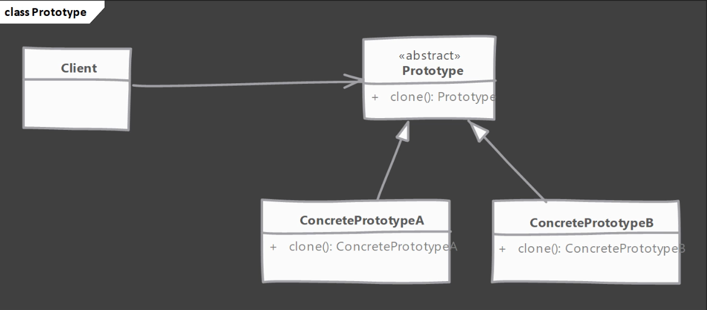

En Java, este patrón de diseño es muy fácil de implementar.

- `Prototype`: Tiene el rol de `Prototype`.
  - Objetos de esta clase nos servirán para usarlos como prototipo y poder crear múltiples copias.
  - Clase abstracta donde se declara un método para poder clonar un objeto a sí mismo.
    - En Java la operación que nos permite crear copias es la operación `clone`.
    - La clase Object de Java ya tiene definido un método `protected` llamado `clone()`, cuyo objetivo es hacer copias de un objeto existente.
- `ConcretePrototypeA` y `ConcretePrototypeB`: Tienen el rol de `Concrete Prototype`.
  - Implementaciones de `Prototype` que implementan el método `clone()`.
- `Client`: Tiene el rol de `Client`.
  - Crea nuevas instancias usando el método `clone()` del prototipo.

#### Prototype - Implementation Steps

Los pasos para implementar el patrón de diseño `prototype` son:

- Comenzamos creando una clase que será un prototipo.
  - La clase debe implementar la interface `Cloneable`.
    - `Cloneable` es una interface de Java incorporada. Es una `marker interface`, lo que significa que es una interface que NO define ningún método, pero que sirve como un marcador o indicación de la capacidad de nuestra clase. Por tanto, si implementamos `Cloneable` estamos diciendo a otro código que la clase soporta la operación `clone`.
  - La clase debe sobreescribir (`override`) el método `clone()` y devolver una copia de sí mismo.
    - El método `clone()` es un método `protected` de la clase `Object` pero, al sobreescribir este método, lo haremos `public`.
  - La firma del método debe declarar `CloneNotSupportedException` en la cláusula `throws` para dar a las subclases la posibilidad de decidir si soporta la clonación.
- La implementación del método `clone()` debe considerar las copias `deep` y `shallow` y elegir la que sea aplicable.
  - La copia `shallow` consiste en copiar las propiedades del objeto a un nuevo objeto.
  - La copia `deep` consiste en crear todos los objetos que son necesarios para nuestro objeto `prototype`.

#### Prototype - Example UML

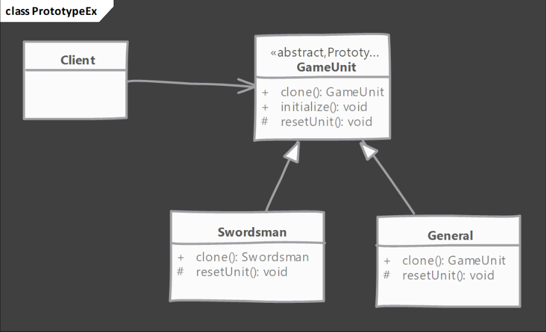

Indico el orden en que se implementa el patrón de diseño:

- `GameUnit`: Toma el rol `Prototype`. Objetos de esta clase soportarán la operación de clonado.
  - Tenemos los métodos `clone()`, `initialize()` y `resetUnit()`.
- `Swordsman` y `General`: Toman el rol `Concrete Prototype`. Son las subclases que implementan `GameUnit`.
  - `Swordsman` soporta la clonación y `General` no soporta la operación de clonación.
- `Client`: Toma el rol `Client`.
  - Crea el objeto inicial y luego usa el patrón de diseño `prototype` para clonar a partir de ese objeto inicial ya existente.

#### Prototype - Implementation

En `src/java/com/jmunoz` creamos los paquetes/clases siguientes:

- `sec05`
  - `prototype` 
    - `GameUnit`: Es la clase base de todas las clases de nuestro prototipo. Es el rol `Prototype`.
      - Representa una unidad en un juego que se juega en un mapa.
      - Tiene una sola propiedad `position` que representa una posición en un mapa.
      - Esta clase ya viene medio desarrollada y lo que se implementa es la parte del patrón de diseño `prototype`.
        - En concreto, se indica que implementa la interface `Cloneable` y se sobreescribe el método `clone()`.
    - `Swordsman`: Implementación de `GameUnit`. Es el rol `Concrete Prototype`.
      - Tiene una propiedad llamada `state`, referida al estado actual de un espadachín concreto.
      - Soporta la clonación.
      - Esta clase ya viene medio desarrollada y lo que se implementa es el método `reset()`.
    - `General`: Implementación de `GameUnit`. Es el rol `Concrete Prototype`.
      - Tiene una propiedad llamada `state`, referida al estado actual de un general concreto.
      - No soporta la clonación porque solo puede haber un general en nuestro juego.
      - Esta clase ya viene medio desarrollada y lo que se implementa son los métodos `reset()` y `clone()`.
    - `Point3D`: Clase que aporta su tipo a GameUnit. No es realmente importante.
    - `Client`: Creamos la instancia inicial de `Swordsman` usando su constructor y usamos el patrón de diseño `prototype`. Es el rol `Client`.

#### Prototype - Implementation & Design

- Consideraciones de implementación:
  - Prestar atención a las copias `deep` y `shallow` de referencias.
    - Para objetos inmutables como parte del estado de `prototype`, hacer `shallow copy`, es decir, la copia puede mantener el puntero a esos mismos objetos.
    - Para objetos mutables como parte del estado de `prototype`. es muy posible que necesitemos hacer `deep copy`.
  - Asegurarse de resetear el estado del objeto antes de devolver el `prototype`. Es una buena idea implementar este método para permitir a las subclases que puedan inicializarse ellas mismas.
  - El método `clone()` es `protected` en la clase `Object` y debe sobreescribirse como `public` para poder ser llamado fuera de esta clase.
  - `Cloneable` es una interface `marker`, es decir, que no define ningún método, pero indica que la clase soporta la operación de clonado.
- Consideraciones del diseño:
  - El patrón de diseño `prototype` es muy útil cuando tenemos objetos muy grandes donde la mayoría del estado no cambia entre instancias y se puede identificar fácilmente que parte de ese estado es inmutable y que parte cambia para las varias instancias.
  - Un registro `prototype` es una clase donde se pueden registrar varios prototipos en los que otro código puede acceder y clonar instancias. Esto resuelve el problema de obtener acceso a la instancia inicial desde cualquier parte del código.
  - Los prototipos son muy útiles cuando trabajan junto a los patrones de diseño `Composite` y `Decorator`.

#### Prototype - Example

Vamos a ver ejemplos del mundo real donde se usa `prototype`.

- El método `Object.clone()` es un ejemplo de `prototype` presente en la biblioteca de clases de Java.
- Este método es proveído por Java y puede clonar objetos existentes, permitiendo a cualquier objeto actuar como prototipo. Las clases siguen necesitando implementar la interface `Cloneable`, pero el método hace el trabajo de clonar el objeto.

#### Prototype - Comparison with Singleton

- `Prototype`
  - Devolvemos una copia de una instancia, es decir, obtenemos una instancia diferente.
  - Algunos o incluso todos los estados de instancias creados con el patrón de diseño `prototype` pueden ser diferentes, ya que el estado puede ser mutable.
- `Singleton`
  - Devolvemos siempre la misma instancia.
  - Ya que es el mismo objeto el que se devuelve, el estado es siempre el mismo.

#### Prototype - Pitfalls

- La usabilidad depende del número de propiedades en el estado que son inmutables o a las que se les puede hacer `shallow copy`. Un objeto donde el estado se compone de una gran cantidad de objetos mutables es complicado de clonar porque tenemos que proveer `deep copy` de todos esos objetos mutables.
- En Java, la operación `clone` por defecto solo realiza `shallow copy`, así que si necesitamos `deep copy` tendremos que implementarla.
- Puede que las subclases no puedan soportar la operación `clone` y el código se vuelva más complicado al tener que codificar situaciones donde una implementación no soporte dicha operación `clone`, lanzando la excepción `CloneNotSupportedException`.

### Abstract Factory

#### Abstract Factory - Introduction

¿Qué es `abstract factory` y donde podemos usarlo?

- Se usa `Abstract Factory` cuando tenemos dos o más objetos que están diseñados para trabajar juntos formando un kit o set y puede haber muchos sets o kits que pueden ser creados por código cliente.
- La intención tras `Abstract Factory` es separar o aislar el código cliente de implementaciones concretas de objetos, formando tal set, y también del código que crea esos sets de objetos.

**UML**

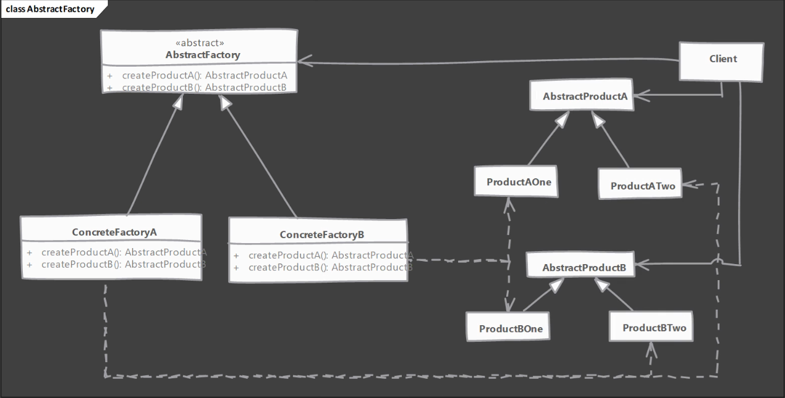

Como este UML es bastante complejo, vamos a ir directamente al ejemplo que vamos a usar para comprender este patrón.

Vamos a usar un juego de ordenador de estrategia tipo Civilization para comprender para qué es útil el patrón de diseño `Abstract Factory`.

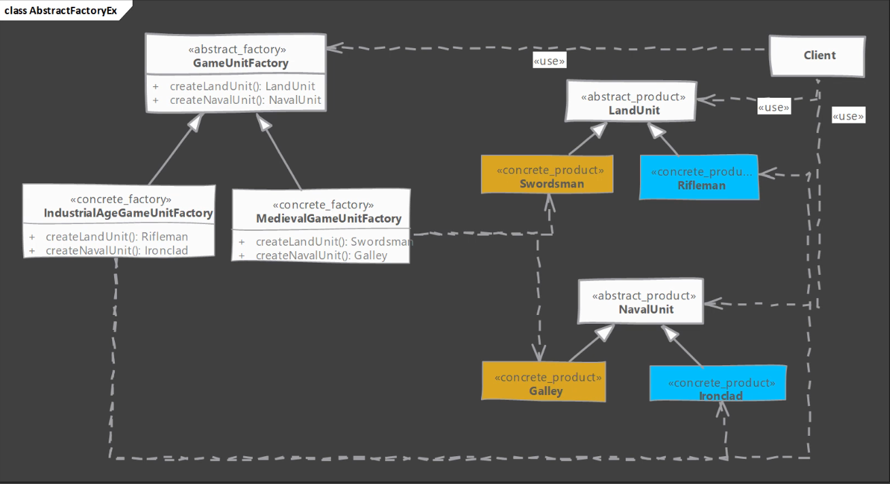

- `LandUnit`: Es una clase abstracta o interface.
  - `Swordsman`: Implementación de `LandUnit` cuando estamos jugando en la época medieval.
  - `Rifleman`: Implementación de `LandUnit` cuando estamos en la época industrial.
- `NavalUnit`: Es una clase abstracta o interface.
  - `Galley`: Implementación de `NavalUnit` cuando estamos jugando en la época medieval.
    - `Swordsman` y `Galley` forman un set, es decir, trabajan juntas.
  - `Ironclad`: Implementación de `NavalUnit` cuando estamos jugando en la época industrial.
    - `Rifleman` y `Ironclad` forman un set, es decir, trabajan juntas.
- `GameUnitFactory`: Es la interface `abstract factory` donde podemos codificar toda la creación de objetos.
  - Solo define dos métodos, uno para crear `LandUnit` y otra para crear `NavalUnit`.
  - `MedievalGameUnitFactory`: Implementación de `GameUnitFactory` que crea objetos de `Swordsman`y `Galley`, es decir, objetos que pertenecen a la época medieval.
  - `IndustrialAgeGameUnitFactory`: Implementación de `GameUnitFactory` que crea objetos de `Rifleman`y `Ironclad`, es decir, objetos que pertenecen a la época industrial.

Con esta explicación, volvemos a nuestro UML inicial.

- `AbstractProductA`: Tiene el rol `Abstract Product`.
  - Es una interface para un tipo de producto que es usado por nuestro cliente.
- `ProductAOne` y `ProductATwo`: Tienen el rol `Concrete Product`.
  - Implementan la interface con rol `Abstract Product`.
- `AbstractFactory`: Tiene el rol `Abstract Factory`.
  - Es una interface donde se definen las operaciones necesarias para crear `Abstract Product` de un tipo concreto.
- `ConcreteFactoryA` y `ConcreteFactoryB`: Tienen el rol `Concrete Factory`.
  - Son las implementaciones de `Abstract Factory` y crean productos de un set particular.
- `Client`: Tiene el rol `Client`.
  - Usa implementaciones de `Abstract Factory` para crear los distintos sets de `Abstract Product`.

#### Abstract Factory - Implementation Steps

Los pasos para implementar el patrón de diseño `abstract factory` son:

- Empezamos estudiando los sets o kits o familias de productos que están presentes en nuestra aplicación.
  - Crear `abstract factory` como una clase abstracta o una interface.
  - Dentro de la interface `Abstract Factory` definir métodos abstractos que permitan al código de cliente crear los objetos.
  - Proveer implementaciones concretas de `factory` para cada set de productos.
- `Abstract Factory` hace uso del patrón `factory method`. Podemos pensar que `abstract factory` es un objeto con múltiples `factory methods`.

#### Abstract Factory - Example UML

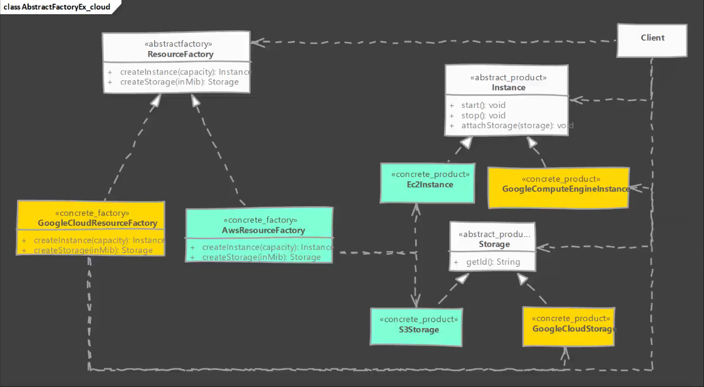

En este ejemplo vamos a implementar un sistema en el que representamos recursos cloud que podemos suministrar con diferentes proveedores cloud, en concreto tenemos en cuenta AWS y Google Cloud.

Lo importante es ver como creamos familias de objetos que están relacionadas entre sí.

Indico el orden en que se implementa el patrón de diseño:

- `Instance`: Toma el rol `Abstract Product`.
  - Interface que representa un recurso de ordenador.
- `Ec2Instance`: Toma el rol `Concrete Product`. Implementa `Instance`.
  - Es de AWS.
- `GoogleComputeEngineInstance`: Toma el rol `Concrete Product`. Implementa `Instance`.
  - Es de Google.
- `Storage`: Toma el rol `Abstract Product`.
- `S3Storage`: Toma el rol `Concrete Product`. Implementa `Storage`.
  - Es de AWS.
- `GoogleCloudStorage`: Toma el rol `Concrete Product`. Implementa `Storage`.
  - Es de Google.
- `Client`: Toma el rol `Client` y tiene el método `main()` y recibe una petición para provisionar una máquina y se decide que tipo de proveedor usar.
- `ResourceFactory`: Toma el rol `Abstract Factory`.
  - Interface que provee dos `factory methods`.
- `AwsResourceFactory`: Toma el rol `Concrete Factory`, y es una implementación de `ResourceFactory` para instanciar objetos de AWS.
- `GoogleCloudResourceFactory`: Toma el rol `Concrete Factory`, y es una implementación de `ResourceFactory` para instanciar objetos de Google.

#### Abstract Factory - Implementation

En `src/java/com/jmunoz` creamos los paquetes/clases siguientes:

- `sec06`
  - `abstractfactory` 
    - `Instance`: Interface que representa un recurso de computador que está disponible para proveedores de cloud como Amazon y Google Cloud.
      - Se definen métodos genéricos que pueden ser llamados independientemente de la implementación que vayamos a usar.
      - Toma el rol `Abstract Product`.
    - `Storage`: Interface que abstrae el almacenamiento en la nube disponible desde varios proveedores de cloud.
      - Toma el rol `Abstract Product`.
    - `ResourceFactory`: Interface que representa nuestro `abstract factory`.
      - Es una de las clases que vamos a codificar en esta lección.
      - Añadimos métodos para crear objetos de los tipos `Instance` y `Storage`.
      - Toma el rol `Abstract Factory`.
    - `aws`: Paquete para Amazon Web services.
      - `Ec2Instance`: Clase que implementa la interface `Instance`. Representa un recurso de computador en Amazon Cloud.
        - Toma el rol `Concrete Product`
      - `S3Storage`: Clase que implementa la interface `Storage`. Representa almacenamiento en Amazon Cloud.
        - Toma el rol `Concrete Product`
      - `AwsResourceFactory`: Clase que implementa la interface `ResourceFactory`.
        - Es una de las clases que vamos a codificar en esta lección.
        - Sobreescribimos los métodos de `ResourceFactory` para devolver objetos de `Ec2Instance` y `S3Storage`.
        - Toma el rol `Concrete Factory`.
    - `gcp`: Paquete para recursos Google Compute Engine.
      - `GoogleComputeEngineInstance`: Clase que implementa la interface `Instance`. Representa un recurso de computador en Google Cloud.
        - Toma el rol `Concrete Product`
      - `GoogleCloudStorage`: Clase que implementa la interface `Storage`. Representa almacenamiento en Google Cloud.
        - Toma el rol `Concrete Product`
      - `GoogleResourceFactory`: Clase que implementa la interface `ResourceFactory`.
        - Es una de las clases que vamos a codificar en esta lección.
        - Sobreescribimos los métodos de `ResourceFactory` para devolver objetos de `GoogleComputeEngineInstance` y `GoogleCloudStorage`.
        - Toma el rol `Concrete Factory`.
      - `Client`: Clase que sirve para usar nuestro `Abstract Factory`.
        - Es una de las clases que vamos a codificar en esta lección.
        - Toma el rol `Client`.

#### Abstract Factory - Implementation & Design Considerations

- Consideraciones de implementación:
  - Las factorías pueden implementarse como `singletons`, ya que normalmente solo necesitaremos una única instancia. Pero asegúrate de familiarizarte con las desventajas del patrón `Singleton`.
  - Añadir un nuevo tipo de producto requiere cambios en la factoría base y en las implementaciones del `factory`.
  - Proveemos el código del cliente con `Concrete Factory` para que pueda usar esa factoría para crear objetos.
- Consideraciones del diseño:
  - Cuando se quiera restringir la creación de objetos para que todos ellos trabajen juntos como un set o kit de objetos, entonces `abstract factory` es un buen patrón de diseño.
  - `Abstract Factory` usa el patŕon de diseño `Factory Method`.
  - Si los objetos son costosos de crear entonces podemos cambiar de forma transparente las implementaciones de la factoría para usar el patrón de diseño `Prototype` o `Singleton` y así crear esos objetos.

#### Abstract Factory - Example

Vamos a ver ejemplos del mundo real donde se usa `abstract factory`.

- El paquete `javax.xml.parsers.DocumentBuilderFactory` que es parte de la API de Java para XML, es un buen ejemplo de uso del patrón de diseño `Abstract Factory`.
- Sin embargo, esta implementación no coincide al 100% con el UML de `abstract factory` dado por `GoF`. La clase tiene un método `static newInstance()` que devuelve el objeto de clase de factoría real usado para crear diferentes productos.
- El método `newInstance()` usa `classpath scanning`, `system properties` y un `external property file` como formas de encontrar la implementación real de la clase factoría y crear el objeto de factoría. Así que podemos cambiar la clase factoría usada, incluso aunque este sea un método estático.

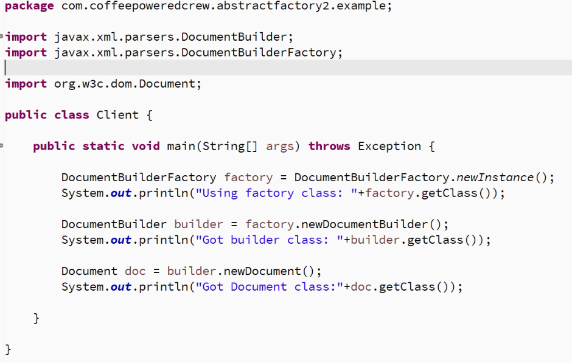

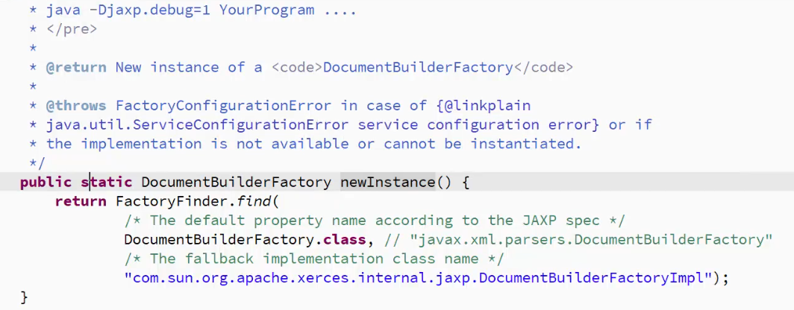

#### Abstract Factory - Comparison with Factory Method

- `Abstract Factory`
  - Oculta las factorías al igual que los objetos concretos usados desde el código del cliente.
  - Adecuado cuando muchos objetos están diseñados para trabajar juntos y el cliente debe usar productos de una sola familia a la vez.
- `Factory Method`
  - Oculta los objetos concretos usados desde el código del cliente.
  - Se preocupa de un producto y sus subclases. La colaboración de un producto con otros objetos es irrelevante.

#### Abstract Factory - Pitfalls

- Es bastante más complejo de implementar que el patrón de diseño `Factory Method` o que cualquier otro patrón de diseño creacional.
- Un nuevo requerimiento para añadir un nuevo producto requiere cambios en la base de la factoría y en TODAS las implementaciones del `factory`.
- Es difícil visualizar que necesitamos este patrón de diseño al comienzo de un desarrollo, y normalmente se comienza creando `Factory Method`.
- El patrón de diseño `Abstract Factory` es muy específico al problema de familias de productos. Difícilmente se puede aplicar para resolver otros tipos de problemas.

### Singleton

#### Singleton - Introduction

Este patrón de diseño creacional es uno de los más usados.

¿Qué es `singleton` y donde podemos usarlo?

- Una clase `singleton` tiene solo una instancia, accesible globalmente a través de un único punto.
  - Se provee acceso a esa instancia via un método o campo público en la clase `singleton`.
- El principal problema que resuelve este patrón es el asegurar que solo existe una instancia de una clase.
- Tener en cuenta que cualquier estado añadido al `singleton` formará parte del estado global de la aplicación, ya que la instancia `singleton` es compartida globalmente.
  - Un estado global muy grande es un indicativo de un mal diseño o implementación.

- Tener en cuenta que hay muy pocas situaciones donde el patrón de diseño `Singleton` es adecuado.
  - Los valores de configuración de una aplicación pueden ser rastreados usando `singleton`. Normalmente, son leídos desde un fichero al comienzo de la ejecución y se usan en otras partes de la aplicación.
    - Eso sí, estos valores deben ser inmutables, es decir, que no se cambien los valores de configuración en el código.
    - Si ese fuera el caso, valores mutables, entonces usar `singleton` se ve como un anti-patrón.
  - Frameworks de logging, como también hacen uso del patrón de diseño `Singleton`.
  - El framework `Spring` trata todos los beans como `singleton` por defecto. En `Spring` no tenemos que hacer nada para asegurarnos de que realmente son instancias únicas, ya lo hace automáticamente.

**UML**

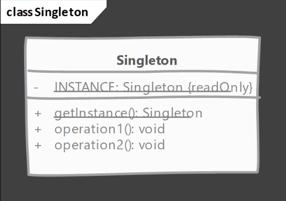

- `Singleton`: Toma el ron `Singleton`.
  - Responsable de crear una única instancia.
  - Provee un método estático, normalmente llamado `getInstance()` para obtener la instancia.

#### Singleton - Implementation Steps

- Controlar la creación de la instancia para asegurarnos de que solo hay una instancia.
  - Él, o los constructores existentes, no puede ser accesibles globalmente.
  - No se permite crear subclases ni herencia, ya que la creación de las subclases no quedaría bajo nuestro control.
- Mantener un registro de la instancia.
  - La clase `Singleton` misma es un buen lugar para mantener el registro de la instancia.
- Dar acceso a la instancia `singleton`.
  - Una buena posibilidad es un método `public static`.
  - Se puede exponer la instancia como un campo `final public static`, pero no funcionará en todas las implementaciones de `singleton`.

Hay dos formas de implementar el patrón de diseño `Singleton`:

- Inicialización temprana - `Eager Singleton`.
  - Es un `singleton` cuya instancia es creada tan pronto como se carga la clase. No esperamos a que alguien pregunte por esa instancia.
- Inicialización perezosa - `Lazy Singleton`
  - Es un `singleton` cuya instancia es creada la primera vez que es requerida.

#### Singleton - Implementation - Eager Singleton

En `src/java/com/jmunoz` creamos los paquetes/clases siguientes:

- `sec07`
  - `eagersingleton`
    - `EagerRegistry`: Clase con el rol `Singleton`.
      - Inicialización temprana. 
      - Desarrollamos el código.
    - `Client`: Clase para trabajar con `EagerRegistry`.

#### Singleton - Implementation - Lazy Singleton

Implementamos `Lazy Singleton` usando `double check locking` y `volatile`.

En `src/java/com/jmunoz` creamos los paquetes/clases siguientes:

- `sec07`
  - `lazysingletondcl`
    - `LazyRegistryWithDCL`: Clase con el rol `Singleton`.
      - Inicialización perezosa usando `double check locking` y `volatile`.
      - Desarrollamos el código.
    - `Client`: Clase para trabajar con `LazyRegistryWithDCL`.

#### Singleton - Implementation - Initialization Holder

Se muestra otra forma de implementar `Lazy Singleton`, usando `holder idiom`.

Esta es, quizás, la mejor forma de crear un `Lazy Singleton`.

En `src/java/com/jmunoz` creamos los paquetes/clases siguientes:

- `sec07`
  - `lazysingletoniodh`
    - `LazyRegistryIODH`: Clase con el rol `Singleton`.
      - Inicialización perezosa usando `holder idiom`.
      - Desarrollamos el código.
    - `Client`: Clase para trabajar con `LazyRegistryIODH`.

#### Singleton - Implementation - Enum

Se muestra otra forma de implementar `Singleton`, usando un enum.

En `src/java/com/jmunoz` creamos los paquetes/clases siguientes:

- `sec07`
  - `lazysingletonenum`
    - `RegistryEnum`: Enum con el rol `Singleton`.
      - Desarrollamos el código.

#### Singleton - Implementation & Design Considerations

- Consideraciones de implementación:
  - La inicialización `Early/Eager` es la foram más sencilla y la preferida para crear un `singleton`.
    - Siempre intentar usar primero esta forma y, solo si tenemos algún problema con el tiempo de inicio de la aplicación, intentar los otros enfoques.
  - El patrón de diseño `Lazy Singleton` clásico usa `double check locking` y un campo `volatile`. Lo veremos muchas veces en el mundo real.
  - El patrón de diseño `Lazy Singleton` con `initialization holder idiom` provee lo mejor de ambos mundos, ya que no tenemos que tratar directamente con problemas de sincronización y es fácil de implementar.
    - Si necesitamos `Lazy Singleton` esta forma es la que deberíamos intentar implementar primero.
  - También podemos implementar `Singleton` usando enums. Sin embargo, debido a la idea preconcebida sobre lo que es un enum, es difícil de "vender" esta idea en una revisión de código, especialmente si el `Singleton` tiene campos mutables, ya que los enums están pensados para ser constantes.
    - Si usamos enum para construir `Singleton`, mejor asegurarnos de que el estado es inmutable.
  - Por último, si la solución más sencilla funciona, `Eager Singleton`, ¡úsala!
- Consideraciones del diseño:
  - La creación de `Singleton` no necesita de ningún parámetro. Si necesitamos que el constructor tenga argumentos, en vez de `Singleton` necesitaremos usar el patrón de diseño `Simple Factory` o `Factory Method`.
  - Asegurarnos de que nuestros `singletons` NO tengan mucho estado global mutable.
    - Actualmente, `Singleton` es considerado un anti-patrón, es decir, que debemos evitarlo porque causa muchos problemas.
    - Para evitar problemas, intentar que el estado de un `singleton` sea inmutable.

#### Singleton - Example

- La clase `java.lang.Runtime` de la API estándar Java es un muy buen ejemplo de uso de `Eager Singleton`.

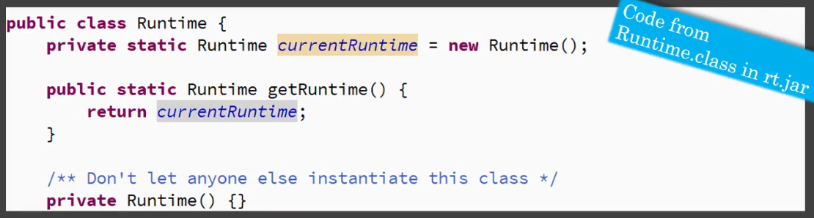

#### Singleton - Comparison with Factory Method

- `Singleton`
  - El propósito principal del patrón de diseño `Singleton` es asegurarnos de que solo se crea UNA instancia de una clase.
  - La instancia `Singleton` se crea sin necesidad de que el código cliente envie argumentos.
- `Factory Method`
  - Se usa principalmente para aislar el código del cliente de la creación de objetos y delegar la creación de objetos a subclases.
  - Permite parametrizar la creación de objetos.

#### Singleton - Pitfalls

- El patrón de diseño `Singleton` puede engañarnos sobre las dependencias que tenemos en el código.
  - Ya que son accesibles globalmente, es fácil que partes de nuestro código comiencen a depender de esta instancia `Singleton`, y esta dependencia no es obvia de ver.
- Son complicadas de probar con `unit testing`. No es fácil hacer un `mock` de la instancia que se devuelve.
- La manera más común de implementar `Singleton` en Java es usando variables estáticas, y estas son mantenidas por el `class loader` y no por la `JVM`. Así que podrían NO ser `Singleton` verdaderas en una aplicación web o en `OSGi`.
  - Si tenemos una clase `Singleton` desplegada en dos aplicaciones web separadas que se están ejecutando en una única instancia de `Tomcat`, entonces tenemos dos instancias `singleton` en una única `JVM`.
  - Esto no suele ser un problema, pero si el `singleton` está atado a un recurso externo único, debemos tener en cuenta que una variable estática significa una copia por `class loader`, no por `JVM`.
- Si tenemos un `singleton` con una gran cantidad de estado global MUTABLE, esto indica muy claramente que estamos abusando del patŕon `Singleton`.
  - Esta es la razón principal por la que actualmente se considera a este patrón como un anti-patrón, y se intente evitar. Tener un estado global mutable se considera una mala práctica.

### Object Pool

#### Object Pool - Introduction

Si se ha trabajado con pool de conexiones en programa JDBC, o con thread pool, entonces ya se ha usado `Object Pool`.

En esta sección, vamos a ver como crear nuestro propio `Object Pool`, que puede cachear cualquier objeto que queramos.

¿Qué es `object pool` y donde podemos usarlo?

- En nuestro sistema, si el **coste de crear una instancia de una clase es alto**, ya sea un coste de rendimiento o porque ese objeto consume un recurso externo limitado (como un thread o un socket), y necesitamos una gran cantidad de objetos de esa clase **por corta duración**, podemos crear un `Object Pool`.
- Hay muy pocos escenarios donde un `object pool` puede mejorar el rendimiento. De hecho, podemos afectar negativamente al rendimiento de la aplicación si no se implementa este patrón de diseño con cuidado.
- Hay un par de formas en las que podemos añadir objetos en el `object pool`.
  - Podemos pre-crear objetos de la clase o recolectar instancias no utilizadas en una memoria caché. Cuando el código necesite un objeto de esa clase lo proveemos desde esa caché.
- Este es uno de los patrones de diseño más complicados de implementar de forma eficiente (y sin defectos).
  - Esto, especialmente al tener que tratar con problemas de `multithreading`.

**UML**

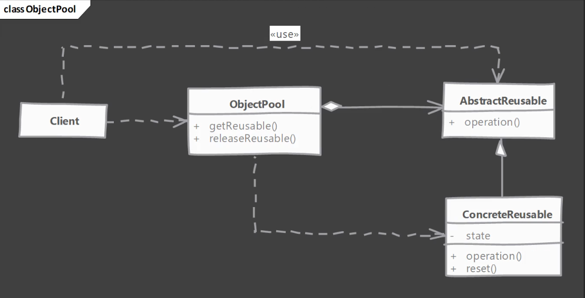

- `AbstractReusable`: Toma el rol `Abstract Reusable Product`.
  - Clase abstracta o interface que representa nuestro objeto.
  - El cliente va a usar operaciones que están definidas en esta interface o clase abstracta.
- `ConcreteReusable`: Toma el rol `Concrete Reusable Product`.
  - Es la implementación de `AbstractReusable`.
  - Esta clase tiene su propio estado.
- `ObjectPool`: Toma el rol `Object Pool`.
  - Cachea las instancias de `Abstract Reusable Product`.
  - Provee un método para que el cliente lo llame y pueda obtener un objeto del `pool`.
  - Provee otro método para que el cliente lo llame y pueda liberar un objeto no usado.
- `Client`: Toma el rol `Client`.
  - Interactúa con `ObjectPool` para obtener instancias de productos reutilizables y devolver objetos no utilizados.

#### Object Pool - Implementation Steps

- Comenzamos creando la clase para `ObjectPool`.
  - Se debe hacer en el `pool` un cacheo de objetos `thread-safe`.
  - Deben proveerse métodos para adquirir y liberar objetos y el `pool` debe resetear los objetos cacheados antes de entregarlos al cliente.
- El objeto reutilizable debe proveer métodos para resetear su estado al ser "liberado" por código.
- ¿Qué pasa cuando el `pool` queda sin objetos?
  - Tenemos que decidir si crear nuevos objetos en el `pool` cuando el `pool` está vacío o esperar hasta que un objeto queda disponible. Esta elección depende de la implementación, y está influenciada si el objeto está atado a un número fijo de recursos externos, donde en este caso tenemos que esperar. En caso contrario, si el objeto no depende de ningún recurso externo o tenemos acceso a recursos ilimitados, podemos crear nuevos objetos y cachearlos cuando vuelvan al `pool`.

#### Object Pool - Example UML

Este es el ejemplo que vamos a implementar usando código Java.

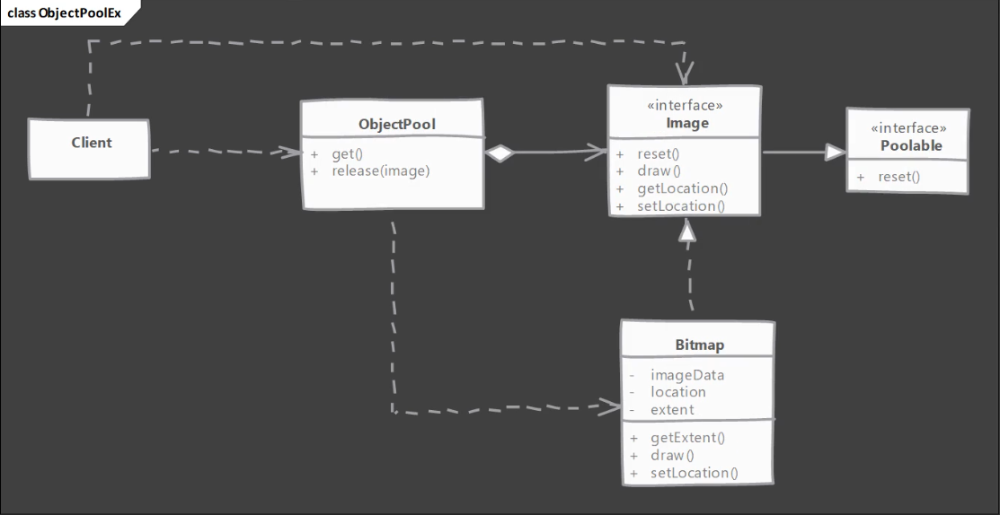

- `Poolable`: Es una interface.
  - Es la interface que va a usar nuestro `ObjectPool`.
  - Podemos tener muchas clases que pueden implementar la interface `Poolable` y ser elegidas para añadirlas al `pool` esn nuestra implementación de `ObjectPool`.
  - Esta interface solo define un método `reset()` para resetear el estado interno de un objeto del `pool`.
- `Image`: Es una interface.
  - Representa una imagen cargada desde disco y que queremos renderizar muchas veces.
- `Bitmap`: Clase concreta, implementación de `Image` con su propio estado.
  - Es estado es el campo `imageData`, que es lo que se carga desde disco. `location` y `extent` son propiedades o partes del estado que necesitan resetearse antes de ser reutilizado.
  - Podemos reutilizar `imageData` porque es lo que vamos a cachear. Cada vez que se crea una instancia de `Image`, no queremos leer desde disco, y por eso hacemos `pool` de ese objeto particular `Bitmap`.
  - Por tanto, mantenemos `imageData` tal cual y reseteamos `location` y `extent`.
- `ObjectPool`: Clase que expone dos métodos importantes:
  - Método `get()`, para devolver al cliente el objeto `Image` del `pool`.
  - Método `release()`, que toma una instancia de un `Bitmap` en particular y lo devuelve al `pool`.

#### Object Pool - Implementation

Ver proyecto `design-patterns-playground`:

- `sec08`
  - `objectpool`
    - `Point2D`: Clase necesaria para el ejemplo.
    - `Poolable`: Es una interface.
      - Es una interface que vamos a codificar.
      - Cualquier clase que implemente esta interface se puede agrupar en nuestro object pool.
    - `Image`: Es una interface que extiende de `Poolable`.
      - Representa una imagen cargada desde disco y que queremos renderizar muchas veces.   
    - `Bitmap`: Clase concreta, implementación de `Image` con su propio estado.
      - Representa un fichero bitmap almacenado en nuestro disco.
      - Vamos a hacer pool de objetos de esta clase para tener objetos en reserva.
      - Tenemos que codificar el método `reset()`, de `Poolable`.
    - `ObjectPool`: Clase donde implementamos nuestro `Object Pool`.
      - Esta clase también la codificamos.
    - `Client`: Clase con método `main()` para usar `ObjectPool`.

#### Object Pool - Implementation & Design Considerations

- Consideraciones de implementación:
  - Resetear el estado de un objeto NO debe ser una operación costosa. En caso contrario podemos perder la ganancia de rendimiento por la cual creamos este patrón de diseño.
  - Podemos pre-cachear objetos, es decir, crear objetos por adelantado cuando se crea `Object Pool` puede ser de ayuda, ya que esto no ralentizará el código que use estos objetos. Sin embargo, puede añadir tiempo de arranque de la aplicación y consumo de memoria, ya que estos objetos creados estarán en memoria.
  - La sincronización implementada en `Object Pool` debe considerar el tiempo necesario para el reseteo y, si es posible, sobre todo si el reseteo lleva mucho tiempo, evitar resetear en un contexto de sincronización.
- Consideraciones del diseño:
  - El método `get()` de `Object Pool` puede parametrizarse, es decir, podemos preguntarle al cliente que pase argumentos y ese será el criterio para devolver diferentes tipos de objetos.
    - De esta forma, podemos usar un único `Object Pool` para cachear objetos de múltiples clases.
  - Agrupar (`pooling`) objetos solo es beneficioso si hay involucrado un coste de inicialización, por ejemplo una inicialización de un recurso externo como una conexión o un thread. No agrupar (`pool`) objetos SOLO para ahorrar memoria, a menos que nos encontremos con errores `OutOfMemory`.
  - No agrupar (`pool`) objetos de larga vida o solo por ahorrar llamadas frecuentes a `new`. `Pooling` podría impactar al rendimiento de forma negativa en estos casos, ya que los objetos van a tardar mucho en volver al `pool` y se va a estar creando nuevos objetos o va a haber muchos bloqueos esperando a que se libere un objeto.

#### Object Pool - Example

- Usar `Object Pool` para ahorrar asignaciones de memoria y `GC` (`garbage collector`) ya está casi `deprecated`. El hardware y la `JVM` son ahora más eficientes y tienen acceso a más memoria.
- Sin embargo, `Object Pool` sigue siendo un patrón de diseño común cuando interactuamos con recursos externos como threads y conexiones.
- Un ejemplo que podemos encontrar en la biblioteca de clases de Java es `java.util.concurrent.ThreadPoolExecutor`. Su función es hacer un `pool` de threads. Incluso aunque podamos usar esta clase directamente, lo normal es usarla via la interface `ExecutorService` usando la clase `Executors` y el método estático `newCachedThreadPool()`.

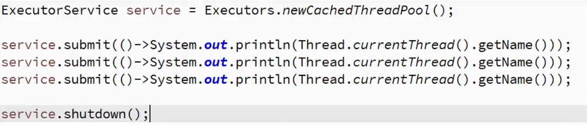

- Otro ejemplo muy común de `Object Pool` es un `pool` de conexiones de BD.
  - La biblioteca `Apache commons dbcp` se usa para `pooling` de conexiones de BD. La clase `org.apache.commons.dbcp.BasicDataSource`, en el paquete `dbcp` es un ejemplo de patrón de diseño `Object Pool` para hacer `pools` de conexiones de BD. Este `pool` suele crearse y exponerse via `JNDI` o como un `bean` de Spring en las aplicaciones.

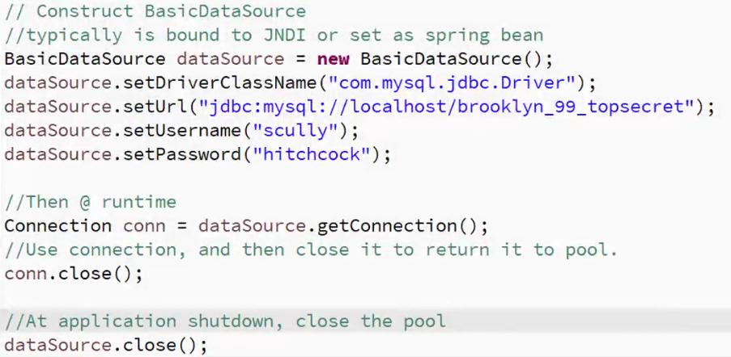

#### Object Pool - Comparison with Prototype

- `Object Pool`
  - Tenemos objetos cacheados que suelen vivir durante toda la ejecución del programa.
  - El código que usa objetos de `Object Pool` tiene que devolver de forma explícita los objetos al `pool`. Dependiendo de la implementación, fallar en esta devolución al `pool` puede llevar a fugas de memoría o de recursos.
- `Prototype`
  - Se crean objetos cuando hace falta y no se cachean.
  - Una vez un objeto se ha clonado no es necesario que el código cliente haga ningún tratamiento especial, y ese objeto puede ser usado como cualquier otro objeto.

#### Object Pool - Pitfalls

- Una implementación exitosa depende de que el código cliente haga un uso correcto, y puede que esto no esté bajo nuestro control. Liberar objetos de vuelta al `pool` puede ser vital para un funcionamiento correcto.
- El objeto reutilizable necesita hacer la tarea de resetear su estado de manera eficiente, es decir, que no conlleve demasiado tiempo. Algunos objetos pueden no ser adecuados para `pooling` debido a este requerimiento.
- Es difícil de usar al refactorizar código legacy, ya que el código cliente y el objeto reutilizable necesitan ambos estar al tanto del `object pool`, ya que el cliente necesita interaccionar con `object pool` y el objeto a agrupar necesita tener la operación de reseteo de estado.
- Son difíciles de optimizar, ya que los `pools` son sensibles a la carga del sistema en tiempo de ejecución (demanda de objetos `pooled`).
- Tenemos que decidir qué ocurre cuando el `pool` está vacío y se pide un objeto. Se puede o bien esperar a que se libere un objeto o bien crear un nuevo objeto. Ambas opciones tienen sus más y sus menos.
  - Esperar puede afectar muy negativamente al rendimiento, incluso llevar a `deadlock`.
  - Si se crean nuevos objetos tendremos que hacer trabajo adicional para mantenerlos o recortar el tamaño del `pool` si no queremos terminar con un `pool` muy grande.

## Structural Design Patterns

Los patrones de diseño estructurales tratan con como se disponen o componen las clases y los objetos para obtener de ellos alguna funcionalidad o comportamiento.

Podemos usar composición y podemos usar herencia, y, cuando combinamos estas dos características tan poderosas podemos obtener comportamientos muy interesantes de nuestras clases y nuestros objetos.

Estos son los patrones de diseño estructurales que vamos a ver en el curso:

- Adapter
- Bridge
- Decorator
- Composite
- Facade
- Flyweight
- Proxy

### Adapter

#### Adapter - Introduction

Es un patrón de diseño estructural. Vamos a ver qué es y por qué lo necesitamos:

- Tenemos un objeto existente que provee la funcionalidad que el cliente necesita. Pero el código del cliente no puede usar este objeto porque espera un objeto con una interface diferente.
- Usando el patrón de diseño `Adapter` hacemos que este objeto existente pueda trabajar con el cliente, al adaptar ese objeto a la interface esperada por el cliente.
- Este patrón también es llamado `Wrapper` ya que envuelve nuestro objeto existente.

**UML**

Existen dos variantes de este patrón de diseño:

- `Class Adapter` también llamado `Two Way Adapter`.
- `Object Adapter`.

Vamos a mirar ambos.

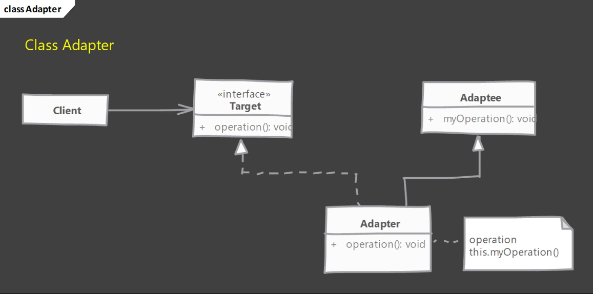

Indicar que este enfoque termina siendo más problemático que útil. Hablaremos más de ello en `Adapter - Pitfalls`.

- `Adaptee`: Es la clase que provee la funcionalidad que necesita `Client`. Tiene el rol `Adaptee`.
  - Tiene un método, llamado en el ejemplo `myOperation()`, que hace exactamente lo que el cliente necesita.
  - Sin embargo, el cliente está esperando un objeto implementado usando la interface `Target`.
- `Target`: Es la interface en la cual `Client` espera que le venga implementado el objeto. Tiene el rol `Target interface`.
  - Tiene un método, llamado en el ejemplo `operation()`.
- `Client`: Tiene el rol `Client`.
  - Necesita la funcionalidad que provee `Adaptee`, pero no así, sino implementando otra interface diferente.
- `Adapter`: Es la clase que usamos para solucionar el problema. Tiene el rol `Adapter`.
  - En `Class Adapter`, `Adapter` es una clase que extiende de nuestra clase existente `Adaptee` que provee la funcionalidad, e implementa la interface `Target` que espera nuestro cliente.
  - Implementamos el método `operation()` para que llame a `myOperation()`.

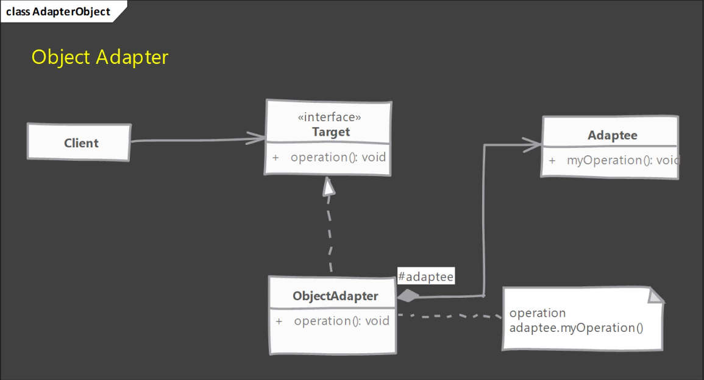

Esta es la forma en la que debemos implementar el patrón de diseño `Adapter`.

- `Adaptee`: Es la clase que provee la funcionalidad que necesita `Client`. Tiene el rol `Adaptee`.
  - Tiene un método, llamado en el ejemplo `myOperation()`, que hace exactamente lo que el cliente necesita.
  - Sin embargo, el cliente está esperando un objeto implementado usando la interface `Target`.
- `Target`: Es la interface en la cual `Client` espera que le venga implementado el objeto. Tiene el rol `Target interface`.
  - Tiene un método, llamado en el ejemplo `operation()`.
- `Client`: Tiene el rol `Client`.
  - Necesita la funcionalidad que provee `Adaptee`, pero no así, sino implementando otra interface diferente.
- `ObjectAdapter`: Es la clase que usamos para solucionar el problema. Tiene el rol `Adapter`.
  - `ObjectAdapter` es una clase que implementa la interface `Target` que espera nuestro cliente, y tenemos un objeto interno de `Adaptee`, dentro de `ObjectAdapter`.
  - Hacemos uso de la composición en vez de la herencia (en `Class Adapter`) para proveer la funcionalidad de `Adaptee`.
  - Usamos el objeto interno y llamamos al método de ese objeto para proveer la funcionalidad.
  - Se le llama `Object Adapter` porque adapta un objeto en vez de extenderlo de nuestra clase `Adaptee`.

#### Adapter - Implementation Steps

- Comenzamos creando una clase para `Adapter`.
  - `Adapter` debe implementar la interface esperada por el cliente.
  - Primero intentamos el enfoque `Class Adapter`, extendiendo de nuestra clase existente.
  - En la implementación de `Class Adapter` solo necesitamos llamar al método heredado de `Adaptee`.
  - Luego para `Object Adapter`, implementamos la interface `Target` y aceptamos `Adaptee` como un argumento del constructor en `Adapter`, para hacer así uso de la composición.
- Un `Object Adapter` debe aceptar como argumento del constructor a `Adaptee` o, como solución no tan buena, se puede instanciar en el constructor, creando un acoplamiento fuerte con un `Adaptee` específico.

#### Adapter - Example UML

Vamos a implementar tanto el enfoque `Class Adapter` como el enfoque `Object Adapter`.

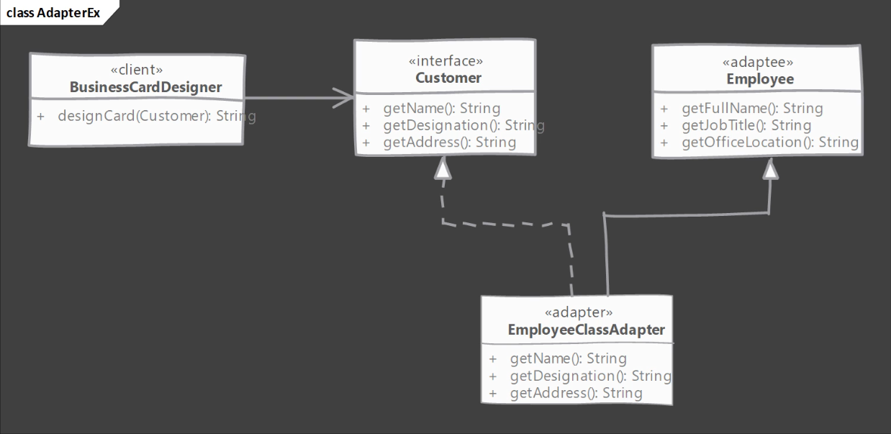

- `BusinessCardDesigner`: Toma el rol `Client`.
  - Es el código que espera un objeto que implemente la interface `Customer`.
- `Customer`: Toma el rol `Target interface`.
  - Tiene métodos que usa nuestro cliente.
- `Employee`: Toma el rol `Adaptee`.
  - Este es el objeto que realmente tenemos en nuestro código.
  - Tiene toda la información que necesita `BusinessCardDesigner`, pero la interface no coincide.
- `EmployeeClassAdapter`: Toma el rol `Adapter`.
  - Es nuestra `Class Adapter`. Extiende de la clase `Employee` e implementa la interface `Customer`.

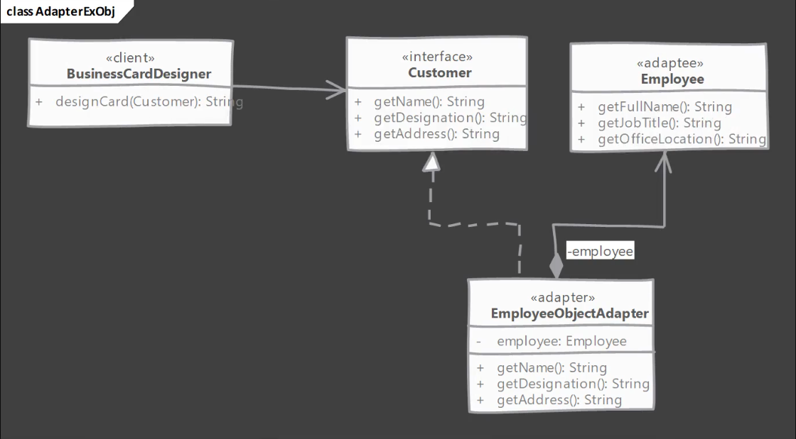

- `EmployeeObjectAdapter`: Toma el rol `Adapter`.
  - Es nuestro `Object Adapter`. Implementa la interface `Customer` y acepta el objeto `Employee` como argumento en nuestro constructor.
  - la implementación de los métodos de `Customer` la delegamos al objeto `Employee`. 

#### Adapter - Implementation - Class Adapter

Ver proyecto `design-patterns-playground`:

- `sec09`
  - `classadapter`
    - `Employee`: Toma el rol `Adaptee`.
      - Este es el objeto que realmente tenemos en nuestro código.
      - Tiene toda la información que necesita `BusinessCardDesigner`, pero la interface no coincide.
    - `BusinessCardDesigner`: Toma el rol `Client`.
      - Es el código que espera un objeto que implemente la interface `Customer`.
    - `Customer`: Toma el rol `Target interface`.
      - Tiene métodos que usa nuestro cliente.
    - `EmployeeClassAdapter`: Toma el rol `Adapter`.
      - Es nuestra `Class Adapter`. Extiende de la clase `Employee` e implementa la interface `Customer`.
      - Esta clase viene sin código y es la que se desarrolla.
    - `Main`: Clase con método `main()` que usa nuestro `Class Adapter`.
      - Esta clase viene medio hecha y la terminamos de desarrollar.

#### Adapter - Implementation - Object Adapter

- `sec09`
  - `objectadapter`
    - `Employee`: Toma el rol `Adaptee`.
      - Este es el objeto que realmente tenemos en nuestro código.
      - Tiene toda la información que necesita `BusinessCardDesigner`, pero la interface no coincide.
    - `BusinessCardDesigner`: Toma el rol `Client`.
      - Es el código que espera un objeto que implemente la interface `Customer`.
    - `Customer`: Toma el rol `Target interface`.
      - Tiene métodos que usa nuestro cliente.
    - `EmployeeObjectAdapter`: Toma el rol `Adapter`.
      - Es nuestro `Object Adapter`. Implementa la interface `Customer` y acepta el objeto `Employee` como argumento en nuestro constructor.
      - la implementación de los métodos de `Customer` la delegamos al objeto `Employee`.
    - `Main`: Clase con método `main()` que usa nuestro `Object Adapter`.
      - Esta clase viene medio hecha y la terminamos de desarrollar.

#### Adapter - Implementation & Design Considerations

- Consideraciones de implementación:
  - La cantidad de trabajo que tenga que hacer `adapter` depende de las diferencias entre el rol `Target Interface` y el objeto que se tiene que adaptar, con rol `Adaptee`. Si los argumentos de los métodos son parecidos, entonces `adapter` tendrá poco trabajo que hacer, poco más que delegar el método.
  - Usar `Class Adapter` nos "permite" sobreescribir alguno de los comportamientos de `Adaptee`. Pero esto es mejor evitarlo, ya que vamos a terminar con `adapter` que se comporta de forma diferente a `Adaptee`. Corregir los defectos ya no será fácil. Es mejor mantenernos simples, delegando el método y cualquier traducción de argumento que se necesite en el `adapter`.
    - Es decir, no cambiar el comportamiento de `Adaptee` en `Class Adapter`.
  - Es beneficioso usar `Object Adapter`, y la principal razón es que potencialmente podemos cambiar el objeto `Adaptee` que es usada en nuestro `Object Adapter` por una de sus subclases.
    - Usando un objeto de la subclase de `Adaptee` en vez de la original tiene el beneficio de poder usar una versión mejorada.
- Consideraciones del diseño:
  - En Java, una `Class Adapter` podría no ser posible si tanto `Target` como `Adaptee` son clases concretas. En ese caso, usar `Object Adapter` es la única solución. Ya que no existe en Java herencia `private`, es mejor quedarnos con `Object Adapter`.
  - `Class Adapter` también es llamada `Two Way Adapter`, ya que puede sustituir tanto a `Target Interface` como a `Adaptee`. Es decir, podemos usar un objeto de `adapter` donde se espera un objeto de `Target Interface` o donde se espera un objeto de `Adaptee`.
    - Pero esto es algo que no queremos hacer porque como no hay herencia `private` en Java, la `Class Adapter` termina con métodos que no están relacionados, ya que tiene métodos tanto de `Target Interface` como de la clase `Adaptee`. Contaminamos la base de código.

#### Adapter - Example

- Las clases Java `java.io.InputStreamReader` y `java.io.OutputStreamWriter` son ejemplos de `Object Adapters`.
- Estas clases adaptan los objetos existentes `InputStream` y `OutputStream` a las interfaces `Reader` y `Writer`, que también forman parte del paquete `java.io`.

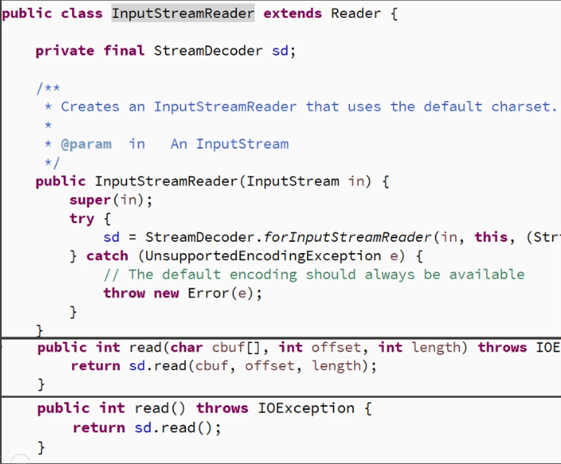

#### Adapter - Comparison with Decorator

- `Adapter`
  - Solo adapta un objeto a otra interface sin cambiar su comportamiento.
  - No es fácil usar composición recursiva, es decir, un `adapter` adaptando otro `adapter` ya que los `adapters` cambian la interface.
- `Decorator`
  - Mejora el comportamiento del objeto sin cambiar su interface. Un `decorator` es indistinguible del objeto que decora.
  - Como los `decorators` no cambian la interface, podemos hacer composición recursiva o, en otras palabras, decorar un `decorator` con facilidad, ya que un `decorator` es indistinguible del objeto principal.

#### Adapter - Pitfalls

- Usando `Target Interface` y la clase `Adaptee` para extender nuestro `adapter`, podemos crear en Java una `Class Adapter`. Sin embargo, esto crea un objeto que expone en partes del código métodos no relacionados, contaminándolo.
  - Evitar `Class Adapter`. Se menciona en este curso para tener un conocimiento completo del patrón de diseño `Adapter`.
- Es muy tentador hacer muchas cosas en `adapter` más allá de una sencilla traducción a interface. Pero esto puede resultar en un `adapter` que muestra un comportamiento diferente al del objeto adaptado.
  - Evitar hacer validaciones, modificaciones o adiciones al comportamiento que provee nuestra clase `Adaptee`.
  - Si se hacen modificaciones y se encuentra un error en la clase `Adaptee`, puede que ese arreglo no sea tan fácil de trasladar a la clase `Adapter`.
- No hay más `pitfalls`. Solo recordar que debemos hacer una sencilla traducción de la clase `Adaptee` a la `Target Interface` y ya.